# Predicate-Based Filtering for go-sse

> Created: 2026-08-03 04:51
> Status: PLANNING

## Problem

DiscordSync (the trigger consumer) hand-rolls consumer-side event filtering:

```go
// sse.go:206 — filter applied AFTER channel delivery
case event := <-eventCh:
    if !filter.matches(event) { continue }  // ← too late, buffer already polluted
    stream.Send(event)
```

This causes two real problems:

1. **Buffer pollution (live path):** Every subscriber's 64-deep channel receives ALL events regardless of their filter. Irrelevant events fill the buffer, potentially displacing relevant ones.

2. **Replay budget waste (reconnection path):** `JournalSSEStore.EventsAfter(lastID)` returns up to 1000 events from the firehose. The consumer then discards ~99% as non-matching. A client watching one channel effectively gets `1000 × matching_fraction` relevant events — potentially near-zero.

DiscordSync proves both are real needs. Every event-driven dashboard built on this library stack will have the same requirement.

## Solution

Add predicate-based filtering at two enforcement points in go-sse:

1. **Live fan-out:** `SubscribeFilter(pred func(T) bool)` — predicate checked BEFORE channel send
2. **Replay:** `FilteredEventStore` interface + `ReplayFiltered` function — predicate pushed into the store query

The consumer owns the predicate (only the consumer knows what `channel_id` means). go-sse owns the enforcement points.

## Design Decisions

### fanout.go: subscriber struct

Change the internal subscriber representation:

```go
// Before:
subscribers map[uintptr]chan T

// After:
type subscriber[T any] struct {
    ch   chan T
    pred func(T) bool // nil = all events
}
subscribers map[uintptr]*subscriber[T]
```

`sendAllLocked` checks each subscriber's predicate before the non-blocking send:

```go
func (f *fanOut[T]) sendAllLocked(msg T) {
    for _, sub := range f.subscribers {
        if sub.pred != nil && !sub.pred(msg) {
            continue
        }
        select {
        case sub.ch <- msg:
        default:
        }
    }
}
```

Zero overhead for unfiltered subscribers (nil check only). `Subscribe()` becomes `SubscribeFilter(nil)`.

### replay.go: FilteredEventStore + ReplayFiltered

```go
type FilteredEventStore interface {
    EventStore
    EventsAfterFiltered(lastID EventID, pred func(Event) bool) ([]Event, error)
}

func ReplayFiltered(stream *Stream, store EventStore, lastID EventID, pred func(Event) bool) (int, error)
```

`ReplayFiltered` does a type assertion: if the store implements `FilteredEventStore`, the predicate is pushed into the store query (efficient). Otherwise, it falls back to `EventsAfter` + in-memory post-filter (correct but budget-inefficient).

Nil pred delegates to existing `Replay` — full backward compatibility.

### Concurrency safety

- Predicates are called inside `sendAllLocked`, which runs under the read lock
- Predicates must be pure, fast, and non-blocking (documented contract)
- Predicates are set at Subscribe time and never mutated — effectively immutable
- No changes to the lock strategy (still RWMutex, still non-blocking sends)

### What this is NOT

- NOT topic/channel routing (named hubs, wildcard matching) — that's a different, more complex abstraction
- NOT payload-format opinions — the predicate is consumer-provided
- NOT a breaking change — all existing APIs are unchanged

## Pareto Breakdown

### The 20% that delivers 80%

| Item | Impact | Why |
|------|--------|-----|
| `SubscribeFilter(pred)` on fanOut | HIGH | Core live-path primitive. Without it, every subscriber's buffer is polluted. |
| `FilteredEventStore` + `ReplayFiltered` | HIGH | Core replay-path primitive. Without it, the replay budget is wasted on irrelevant events. |

### The 4% that delivers 64%

| Item | Impact | Why |
|------|--------|-----|
| `subscriber[T]` struct refactor in fanout.go | CRITICAL | Single data structure change that enables all live-path filtering. Everything else is interface definitions and tests. |

### The 1% that delivers 51%

| Item | Impact | Why |
|------|--------|-----|
| 3-line change in `sendAllLocked` | ATOMIC CORE | `if sub.pred != nil && !sub.pred(msg) { continue }` — the entire feature flows from this one check. |

### The other 20% (to reach 100%)

| Item | Impact | Effort |
|------|--------|--------|
| Tests for SubscribeFilter | HIGH (correctness) | M |
| Tests for ReplayFiltered | HIGH (correctness) | M |
| doc.go, AGENTS.md, ROADMAP.md, CHANGELOG.md | MEDIUM (adoption) | S |
| Example functions | LOW (nice-to-have) | S |

## Comprehensive Task Plan (30-100 min tasks)

| # | Task | Phase | Impact | Effort | Customer Value |
|---|------|-------|--------|--------|----------------|
| T1 | Refactor fanout.go: subscriber struct + SubscribeFilter + sendAllLocked predicate check | Core | CRITICAL | M | Enables all live-path filtering |
| T2 | Add FilteredEventStore interface + ReplayFiltered function to replay.go | Core | HIGH | M | Enables all replay-path filtering |
| T3 | Write tests for SubscribeFilter (basic delivery, nil pred, excludes non-matching, mixed subs, after-close, buffer overflow, race) | Tests | HIGH | L | Proves correctness |
| T4 | Write tests for ReplayFiltered (FilteredEventStore path, fallback path, nil pred, write error, store error) | Tests | HIGH | M | Proves correctness |
| T5 | Update documentation (doc.go, AGENTS.md, ROADMAP.md, CHANGELOG.md, example_test.go) | Docs | MEDIUM | M | Enables adoption |
| T6 | Full verification (race tests, lint, flake check) | Verify | HIGH | S | Confidence |

## Detailed Breakdown (max 12 min tasks)

| # | Task | Parent | Est |
|---|------|--------|-----|
| D1 | Add `subscriber[T]` struct type to fanout.go | T1 | 5min |
| D2 | Change `subscribers` field type from `map[uintptr]chan T` to `map[uintptr]*subscriber[T]` | T1 | 3min |
| D3 | Update `newFanOut` initializer (map value type changes) | T1 | 2min |
| D4 | Update `Subscribe()`: create `&subscriber[T]{ch: ch, pred: nil}` | T1 | 5min |
| D5 | Add `SubscribeFilter(pred func(T) bool) <-chan T` method | T1 | 8min |
| D6 | Refactor `Subscribe()` to delegate to `SubscribeFilter(nil)` | T1 | 3min |
| D7 | Update `Unsubscribe()`: close `sub.ch` instead of `sender` | T1 | 3min |
| D8 | Update `Close()`: close `sub.ch` instead of `ch` | T1 | 3min |
| D9 | Update `sendAllLocked()`: check `sub.pred` before send | T1 | 5min |
| D10 | Verify T1 compiles: `go build ./...` | T1 | 2min |
| D11 | Add `FilteredEventStore` interface to replay.go | T2 | 5min |
| D12 | Add `ReplayFiltered` function to replay.go (with type assertion + fallback) | T2 | 10min |
| D13 | Verify T2 compiles: `go build ./...` | T2 | 2min |
| D14 | Test: SubscribeFilter delivers only matching events | T3 | 10min |
| D15 | Test: SubscribeFilter with nil pred = same as Subscribe | T3 | 5min |
| D16 | Test: mixed filtered + unfiltered subscribers both receive correct events | T3 | 10min |
| D17 | Test: SubscribeFilter after Close returns closed channel | T3 | 5min |
| D18 | Test: filtered subscriber buffer only fills with matching events | T3 | 10min |
| D19 | Test: SubscribeFilter concurrent race (broadcast + subscribe/unsubscribe) | T3 | 10min |
| D20 | Test: ReplayFiltered with FilteredEventStore (predicate pushed to store) | T4 | 10min |
| D21 | Test: ReplayFiltered fallback (plain EventStore + post-filter) | T4 | 8min |
| D22 | Test: ReplayFiltered with nil pred = Replay | T4 | 5min |
| D23 | Test: ReplayFiltered write error propagation | T4 | 5min |
| D24 | Test: ReplayFiltered store error propagation | T4 | 5min |
| D25 | Update doc.go: add "# Filtered Subscriptions" section | T5 | 8min |
| D26 | Update AGENTS.md: concurrency invariants (predicates under RLock) | T5 | 5min |
| D27 | Update ROADMAP.md: move topic routing from "open idea" to realized | T5 | 5min |
| D28 | Add CHANGELOG.md entry for predicate filtering | T5 | 5min |
| D29 | Add Example functions: ExampleSubscribeFilter, ExampleReplayFiltered | T5 | 10min |
| D30 | Run `nix run .#test-race` | T6 | 5min |
| D31 | Run `nix run .#lint` | T6 | 3min |
| D32 | Run `nix flake check` | T6 | 5min |

## Mermaid Execution Graph

```mermaid
graph TD
    subgraph "Phase 1: Core Live Path (1% → 51%)"
        D1[D1: subscriber struct] --> D2[D2: map type change]
        D2 --> D3[D3: newFanOut init]
        D3 --> D4[D4: Subscribe uses struct]
        D4 --> D5[D5: SubscribeFilter method]
        D5 --> D6[D6: Subscribe delegates to SubscribeFilter nil]
        D6 --> D7[D7: Unsubscribe update]
        D7 --> D8[D8: Close update]
        D8 --> D9[D9: sendAllLocked predicate check]
        D9 --> D10{D10: build check}
    end

    subgraph "Phase 2: Core Replay Path (4% → 64%)"
        D11[D11: FilteredEventStore interface] --> D12[D12: ReplayFiltered function]
        D12 --> D13{D13: build check}
    end

    subgraph "Phase 3: Live Path Tests (20% → 80%)"
        D14[D14: basic delivery] --> D15[D15: nil pred compat]
        D15 --> D16[D16: mixed subs]
        D16 --> D17[D17: after close]
        D17 --> D18[D18: buffer overflow]
        D18 --> D19[D19: race test]
    end

    subgraph "Phase 4: Replay Tests"
        D20[D20: FilteredEventStore path] --> D21[D21: fallback path]
        D21 --> D22[D22: nil pred compat]
        D22 --> D23[D23: write error]
        D23 --> D24[D24: store error]
    end

    subgraph "Phase 5: Documentation (other 20%)"
        D25[D25: doc.go] --> D26[D26: AGENTS.md]
        D26 --> D27[D27: ROADMAP.md]
        D27 --> D28[D28: CHANGELOG.md]
        D28 --> D29[D29: Examples]
    end

    subgraph "Phase 6: Verification"
        D30[D30: test-race] --> D31[D31: lint]
        D31 --> D32[D32: flake check]
    end

    D10 --> D11
    D13 --> D14
    D19 --> D20
    D24 --> D25
    D29 --> D30

    style D9 fill:#e1f5fe
    style D5 fill:#e1f5fe
    style D12 fill:#e1f5fe
    style D19 fill:#fff3e0
    style D30 fill:#e8f5e9
```



## API Summary (after implementation)

```go
// Live path — fanout.go (promoted via Broadcaster[T] embedding)
func (b *Broadcaster[T]) Subscribe() <-chan T                        // existing — unchanged
func (b *Broadcaster[T]) SubscribeFilter(pred func(T) bool) <-chan T // NEW

// Replay path — replay.go
type FilteredEventStore interface {                                  // NEW
    EventStore
    EventsAfterFiltered(lastID EventID, pred func(Event) bool) ([]Event, error)
}

func Replay(stream *Stream, store EventStore, lastID EventID) (int, error)                        // existing — unchanged
func ReplayFiltered(stream *Stream, store EventStore, lastID EventID, pred func(Event) bool) (int, error) // NEW
```

## Risk Assessment

| Risk | Likelihood | Mitigation |
|------|------------|------------|
| Predicate panics under RLock | LOW | Document contract: pure, fast, non-blocking |
| Breaking existing subscriber map semantics | LOW | Subscribe() delegates to SubscribeFilter(nil) — same behavior |
| Allocation overhead of *subscriber[T] | NEGLIGIBLE | One alloc per Subscribe call (per connection), not per event |
| cqrs-htmx compatibility | NONE | Type aliases pass through; SubscribeFilter is additive |
| DiscordSync integration | FUTURE | Separate follow-up: extend JournalSSEStore with EventsAfterFiltered |
