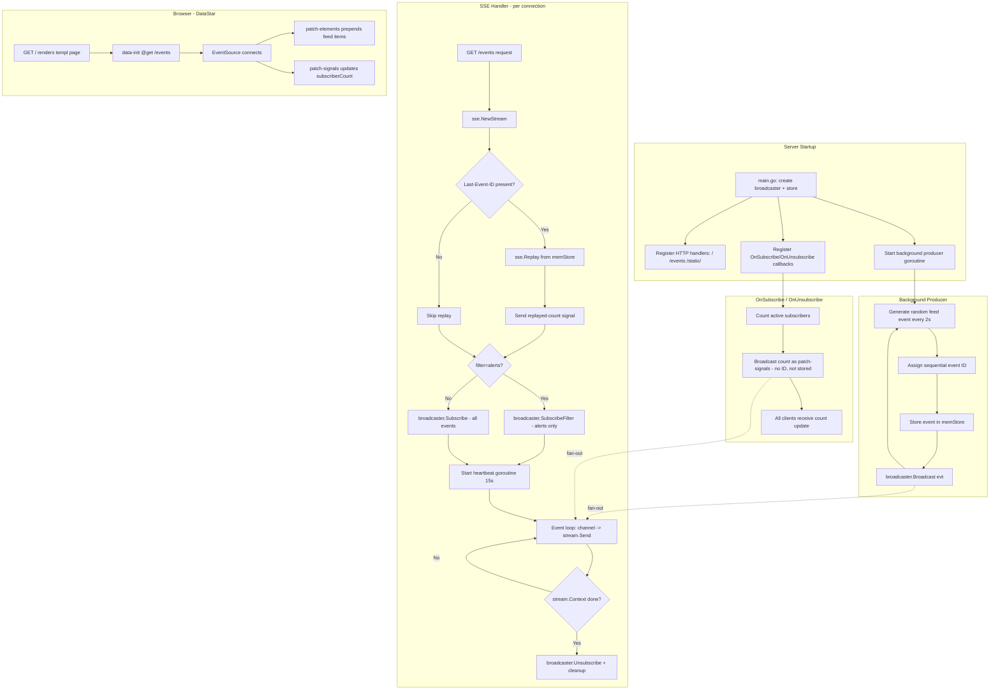

# Rebuild DataStar Example as a Real go-sse Showcase

> Created: 2026-08-06 23:54
> Status: PLANNING

## Problem

The current DataStar example (`example/datastar/`) is a **single-request progress bar** —
a per-request loop that counts 0 to 100 and closes the connection. It demonstrates exactly
**zero** of go-sse's unique capabilities:

| go-sse feature          | Showcased? |
| ----------------------- | ---------- |
| `Broadcaster` fan-out   | No — no broadcaster exists in the example |
| `SubscriberCount`       | No |
| `SubscribeFilter`       | No |
| `EventStore` + `Replay` | No |
| `Heartbeat`             | No |
| `SendKeyed`/`SendLines` | Yes (barely) |
| `Stream` basics         | Yes (barely) |

A visitor could replace the entire example with `fmt.Fprintf(w, "data: ...\n\n")` in a loop
and it would behave identically. **The example fails to justify the library's existence.**

## Solution

Replace the progress bar with a **live activity feed** — a real-time stream of simulated
system events (deploys, alerts, logins) where:

- A background goroutine broadcasts events through a `Broadcaster[sse.Event]`
- Multiple browser tabs all receive the same events live (**fan-out proof**)
- A live subscriber counter updates as tabs open/close (**`SubscriberCount` proof**)
- An "Alerts only" view uses `SubscribeFilter` (**predicate proof**)
- Closing and reopening a tab replays missed events (**`EventStore` + `Replay` proof**)
- A heartbeat keeps connections alive (**`Heartbeat` proof**)

Every go-sse feature is **visually demonstrable in under 30 seconds.**

## Pareto Breakdown

### 1% that delivers 51% of the result

**Replace the per-request loop with a `Broadcaster` + background producer.**

This single architectural change transforms the example from "could be done without this
library" to "this is why you need this library." Without it, nothing else matters.

### 4% that delivers 64% of the result

**Add visible subscriber count via `OnSubscribe`/`OnUnsubscribe` callbacks.**

Instant visual proof of fan-out. Open 3 tabs → counter says "3". Close one → "2".
This is the "aha moment" that makes the library click.

### 20% that delivers 80% of the result

**Add replay (`EventStore` + `Last-Event-ID`) and filtering (`SubscribeFilter`).**

These complete the feature demonstration. Replay proves reconnection works. Filtering
proves the predicate-based routing story.

### The other 20% (to get to 100%)

- UI polish: feed items with type icons, dark/light theme, responsive layout
- README update: describe the new example and what it demonstrates
- Build verification: `go vet`, `go build`, `templ generate`, manual run test

## Architecture

### Data flow

```
Background producer goroutine (every 2s)
    │
    ├── stores sse.Event in memStore (for replay)
    │
    └── broadcaster.Broadcast(evt)
            │
            ├── fan-out to subscriber 1's channel ──→ handler loop ──→ stream.Send ──→ browser tab 1
            ├── fan-out to subscriber 2's channel ──→ handler loop ──→ stream.Send ──→ browser tab 2
            └── fan-out to subscriber N's channel ──→ handler loop ──→ stream.Send ──→ browser tab N

OnSubscribe / OnUnsubscribe callbacks
    │
    └── broadcaster.Broadcast(countSignal(N))  ← NOT stored (ephemeral meta event)

Reconnect (Last-Event-ID header):
    │
    └── sse.Replay(stream, store, lastID) ──→ sends missed events ──→ then live events
```

### Event types

| Event                     | SSE event name              | Has ID? | Stored? | Purpose                          |
| ------------------------- | ---------------------------- | ------- | ------- | -------------------------------- |
| Feed item                 | `datastar-patch-elements`   | Yes     | Yes     | Prepend new item to `#feed` div  |
| Subscriber count          | `datastar-patch-signals`    | No      | No      | Update `$subscriberCount` signal |
| Replay indicator          | `datastar-patch-signals`    | No      | No      | Show "Replayed N events" banner  |

Feed items use `patch-elements` with `mode prepend` so each event adds one item to the top
of the feed. Replay re-applies missed items in order — the feed reconstructs correctly.

### Key design decisions

1. **`Broadcaster[sse.Event]`** (not a wrapper type) — keeps the example simple and matches
   the README's Quick Start pattern. Filtering checks event data content for `"alert"` items.

2. **In-memory ring buffer `EventStore`** — stores the last 50 events. Linear scan for
   `EventsAfter` (fine for a demo; real apps use a database/journal).

3. **Subscriber count via callbacks** — `OnSubscribe`/`OnUnsubscribe` broadcast a meta
   `patch-signals` event with the new count. Meta events have no event ID and are not stored,
   so they don't interfere with replay.

4. **Filtering via query param** — `/?filter=alerts` renders the page with an alerts-only SSE
   endpoint. The handler uses `SubscribeFilter` to reject non-alert events. No complex
   client-side connection management needed.

5. **Heartbeat** — 15s interval, started as a goroutine alongside the event loop.

### mermaid.js execution graph



## Implementation tasks (30-100 min each)

Sorted by importance/impact (highest first).

| #  | Task                                           | Impact | Effort | Customer value |
| -- | ---------------------------------------------- | ------ | ------ | -------------- |
| 1  | Rewrite `main.go`: broadcaster + store + producer | 10     | 60min  | Critical — the core architecture |
| 2  | Implement in-memory `EventStore` (ring buffer) | 8      | 30min  | Critical — enables replay demo |
| 3  | Implement SSE handler with replay + filter + heartbeat | 9  | 45min  | Critical — per-connection logic |
| 4  | Rewrite `index.templ`: feed UI + subscriber count + replay banner | 8 | 45min | High — visual proof of features |
| 5  | Rewrite `styles.css`: feed layout + item types + responsive | 6  | 30min  | Medium — polish |
| 6  | Run `templ generate` and verify build          | 7      | 15min  | Critical — must compile |
| 7  | Manual test: multi-tab, replay, filter, heartbeat | 8    | 20min  | Critical — verify it works |
| 8  | Update README: describe new example features   | 5      | 20min  | Medium — documentation |
| 9  | Update AGENTS.md: example architecture section | 4      | 15min  | Low — AI context |

## Subtask breakdown (max 12 min each)

### Task 1: Rewrite `main.go` (core architecture)

| #   | Subtask                                                | Est  |
| --- | ------------------------------------------------------ | ---- |
| 1.1 | Define constants (addr, interval, maxFeedItems, etc.) | 5min |
| 1.2 | Define `activityServer` struct (broadcaster + store)  | 5min |
| 1.3 | Implement `newActivityServer()` constructor            | 8min |
| 1.4 | Implement `startProducer()` background goroutine       | 12min|
| 1.5 | Implement event generators (deploy/alert/info/success) | 12min|
| 1.6 | Implement `feedItemHTML()` — render one item as HTML   | 10min|
| 1.7 | Wire up OnSubscribe/OnUnsubscribe count broadcasts     | 10min|
| 1.8 | Register HTTP routes and start server                  | 8min |

### Task 2: Implement in-memory EventStore

| #   | Subtask                                                | Est  |
| --- | ------------------------------------------------------ | ---- |
| 2.1 | Define `memStore` struct with mutex + slice + cap     | 5min |
| 2.2 | Implement `Append(evt sse.Event)`                      | 8min |
| 2.3 | Implement `EventsAfter(lastID) ([]Event, error)`       | 10min|
| 2.4 | Handle edge case: empty store, unknown lastID          | 5min |

### Task 3: Implement SSE handler

| #   | Subtask                                                | Est  |
| --- | ------------------------------------------------------ | ---- |
| 3.1 | Implement `eventsHandler` skeleton (stream + defer)    | 8min |
| 3.2 | Add replay logic (Last-Event-ID → Replay → indicator)  | 12min|
| 3.3 | Add filter logic (query param → SubscribeFilter)       | 10min|
| 3.4 | Add heartbeat goroutine                                | 5min |
| 3.5 | Implement event loop (channel → stream.Send)           | 10min|
| 3.6 | Implement `indexHandler` with filter query param       | 8min |

### Task 4: Rewrite `index.templ`

| #   | Subtask                                                | Est  |
| --- | ------------------------------------------------------ | ---- |
| 4.1 | Page skeleton: head, title, DataStar script, CSS link  | 8min |
| 4.2 | Signals init: feed, subscriberCount, replayed, filter  | 5min |
| 4.3 | Header: title + subtitle + filter toggle links         | 10min|
| 4.4 | Stats bar: subscriber count + connection status        | 8min |
| 4.5 | Replay banner (conditional on $replayed > 0)           | 8min |
| 4.6 | Feed container: `#feed` div with data-init             | 5min |

### Task 5: Rewrite `styles.css`

| #   | Subtask                                                | Est  |
| --- | ------------------------------------------------------ | ---- |
| 5.1 | CSS variables: colors for info/alert/success types     | 5min |
| 5.2 | Feed item styles: card layout, type indicators         | 10min|
| 5.3 | Stats bar + replay banner styles                       | 8min |
| 5.4 | Responsive + dark/light theme adjustments              | 7min |

### Task 6-9: Build, test, docs

| #   | Subtask                                                | Est  |
| --- | ------------------------------------------------------ | ---- |
| 6.1 | Run `templ generate`                                    | 3min |
| 6.2 | Run `GOWORK=off GOEXPERIMENT=jsonv2 go vet ./...`      | 3min |
| 6.3 | Run `GOWORK=off GOEXPERIMENT=jsonv2 go build ./...`    | 3min |
| 6.4 | Run `nix run .#lint` (golangci-lint)                    | 5min |
| 7.1 | Start server, open 2+ tabs, verify fan-out              | 5min |
| 7.2 | Close/reopen tab, verify replay                         | 5min |
| 7.3 | Test `/?filter=alerts`, verify filtering                | 5min |
| 7.4 | Verify subscriber count updates                        | 3min |
| 7.5 | Kill server (Ctrl+C), verify no panic                  | 2min |
| 8.1 | Update README "Runnable example" section                | 10min|
| 8.2 | Update README "Framework Integration" to mention demo   | 10min|
| 9.1 | Update AGENTS.md DataStar Example section               | 12min|

## Files to create/modify

| File                          | Action   | Description                           |
| ----------------------------- | -------- | ------------------------------------- |
| `example/datastar/main.go`    | Rewrite  | Broadcaster + store + producer + handler |
| `example/datastar/index.templ`| Rewrite  | Activity feed UI with signals + filter |
| `example/datastar/index_templ.go` | Regenerate | `templ generate` output           |
| `example/datastar/static/styles.css` | Rewrite | Feed layout, item types, stats bar |
| `README.md`                   | Edit     | Update example description            |
| `AGENTS.md`                   | Edit     | Update example architecture section   |

## Risk assessment

| Risk                              | Mitigation                                             |
| --------------------------------- | ------------------------------------------------------ |
| DataStar `patch-elements` syntax wrong | Test manually, check DataStar docs                |
| templ regeneration fails          | Keep templ syntax simple, verify with `templ generate`|
| Replay duplicates feed items      | Use `mode prepend` — replayed items appear in order    |
| Filter blocks meta events         | Meta events have no ID; filter checks for ID presence  |
| json.Marshal warning (go1.27)     | Use `encoding/json/v2` (already imported, GOEXPERIMENT)|
| Broadcaster deadlock in callbacks | Callbacks fire after lock release (verified in source) |
