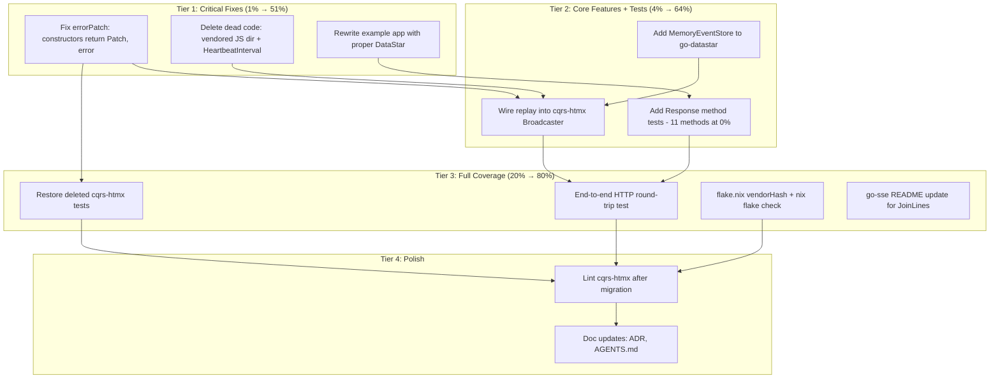

# SUPERB Plan: Fix go-datastar + cqrs-htmx Migration Gaps

**Date:** 2026-08-07 07:45\
**Scope:** Fix every issue identified in the 07-42 status report.

---

## Problem Summary

The go-datastar library was built and cqrs-htmx was migrated off the SDK, but the migration has real gaps: silent error swallowing (`errorPatch`), lost replay support, broken example app, dead code, deleted tests, and missing test coverage.

## Execution Graph

---

## Phase Breakdown (30-100min each)

| Phase | Name                               | Tasks | Est | Tier |
| ----- | ---------------------------------- | ----- | --- | ---- |
| F1    | Fix errorPatch + Dead Code Cleanup | 4     | 30m | T1   |
| F2    | Rewrite Example App                | 3     | 30m | T1   |
| F3    | MemoryEventStore + Replay Wiring   | 4     | 45m | T2   |
| F4    | Response Test Coverage             | 3     | 45m | T2   |
| F5    | Restore cqrs-htmx Tests            | 4     | 45m | T3   |
| F6    | E2E + Integration + Lint           | 4     | 40m | T3   |
| F7    | Docs + Polish                      | 3     | 30m | T4   |

---

## Detailed Tasks (≤12min each)

### Tier 1: Critical Fixes (1% → 51%)

| # | ID   | Task                                                                                                                  | Est |
| - | ---- | --------------------------------------------------------------------------------------------------------------------- | --- |
| 1 | F1-1 | Change `SignalsPatch`, `SignalsIfMissingPatch`, `ElementsTemplPatch` to return `(Patch, error)` — delete `errorPatch` | 10m |
| 2 | F1-2 | Fix all callers in cqrs-htmx (event_bridge_test, handlers, integration_test) for new error-returning constructors     | 10m |
| 3 | F1-3 | Delete orphaned `/home/lars/projects/cqrs-htmx/datastar/datastar/` directory                                          | 1m  |
| 4 | F1-4 | Delete dead `HeartbeatInterval` function from cqrs-htmx/datastar/broadcaster.go                                       | 1m  |
| 5 | F2-1 | Rewrite go-datastar example/main.go — use `data-signals`, `data-init="@get('/events')"`, no manual EventSource JS     | 10m |
| 6 | F2-2 | Verify example compiles                                                                                               | 2m  |
| 7 | F2-3 | Verify all tests still pass after Tier 1                                                                              | 5m  |

### Tier 2: Core Features + Tests (4% → 64%)

| #  | ID   | Task                                                                                                                              | Est |
| -- | ---- | --------------------------------------------------------------------------------------------------------------------------------- | --- |
| 8  | F3-1 | Add `MemoryStore` type to go-datastar (implements `sse.EventStore`, ring buffer with Append + EventsAfter)                        | 10m |
| 9  | F3-2 | Test `MemoryStore` — Append, EventsAfter, ring buffer eviction, numeric ID parsing                                                | 10m |
| 10 | F3-3 | Rewrite cqrs-htmx Broadcaster: add optional EventStore, wire `sse.Replay` in ServeHTTP, add `NewBroadcasterWithReplay`            | 12m |
| 11 | F3-4 | Add replay test to cqrs-htmx broadcaster_test.go                                                                                  | 10m |
| 12 | F4-1 | Add go-datastar Response tests: PatchElementsTempl, MarshalAndPatchSignals, RemoveElementByID, Redirect, ConsoleLog, ConsoleError | 12m |
| 13 | F4-2 | Add go-datastar Response tests: DispatchCustomEvent, ReplaceURL, Prefetch, Send, NewResponseFromHTTP                              | 10m |
| 14 | F4-3 | Verify go-datastar coverage improved                                                                                              | 2m  |

### Tier 3: Full Coverage (20% → 80%)

| #  | ID   | Task                                                                                                                            | Est |
| -- | ---- | ------------------------------------------------------------------------------------------------------------------------------- | --- |
| 15 | F5-1 | Add cqrs-htmx patch_test.go: ElementsPatch, SignalsPatch, RemovePatch, ScriptPatch, RedirectPatch constructors + Event() output | 12m |
| 16 | F5-2 | Add cqrs-htmx response_test.go: NewResponse, PatchElements, PatchSignals, ExecuteScript, RemoveElement                          | 12m |
| 17 | F5-3 | Add go-datastar E2E HTTP round-trip test: HTTP server → SSE client → verify raw wire bytes                                      | 12m |
| 18 | F6-1 | Compute real vendorHash for go-datastar flake.nix + run `nix build`                                                             | 10m |
| 19 | F6-2 | Update go-sse README to document `JoinLines`                                                                                    | 5m  |
| 20 | F6-3 | Run golangci-lint on cqrs-htmx/datastar after migration                                                                         | 5m  |
| 21 | F6-4 | Run full test suite across all repos (go-sse, go-datastar, cqrs-htmx/datastar, integration_test)                                | 5m  |

### Tier 4: Polish

| #  | ID   | Task                                                                                          | Est |
| -- | ---- | --------------------------------------------------------------------------------------------- | --- |
| 22 | F7-1 | Write ADR for go-datastar/go-sse/SDK relationship at go-datastar/docs/adr/001-architecture.md | 10m |
| 23 | F7-2 | Update cqrs-htmx AGENTS.md architecture section                                               | 5m  |
| 24 | F7-3 | Update go-datastar CHANGELOG / verify README accuracy                                         | 5m  |

---

## Key Design Decisions

### errorPatch fix

**Before:** `SignalsPatch(signals any, ...) Patch` → internally calls `json.Marshal` → on error returns `errorPatch{}` which produces empty `sse.Event{}`.

**After:** `SignalsPatch(signals any, ...) (Patch, error)` → on error returns `(nil, err)`. Callers must check. This matches go-datastar's `NewSignalsPatch` signature and the EventBridge's `PatchFunc` return type.

Affected constructors: `SignalsPatch`, `SignalsIfMissingPatch`, `ElementsTemplPatch`.

### MemoryStore

A simple ring buffer in go-datastar that implements `sse.EventStore`. Pattern extracted from go-sse's example `memStore`. Used by cqrs-htmx Broadcaster for replay support.

### Example app fix

**Before:** Manual `EventSource` + `DOMParser` + broken `import { SSE } from "/events"`.

**After:** Pure DataStar — `data-signals` for reactive state, `data-init="@get('/events')"` for SSE connection (DataStar handles the EventSource internally), `data-text="$total"` for display. Zero lines of JavaScript.
