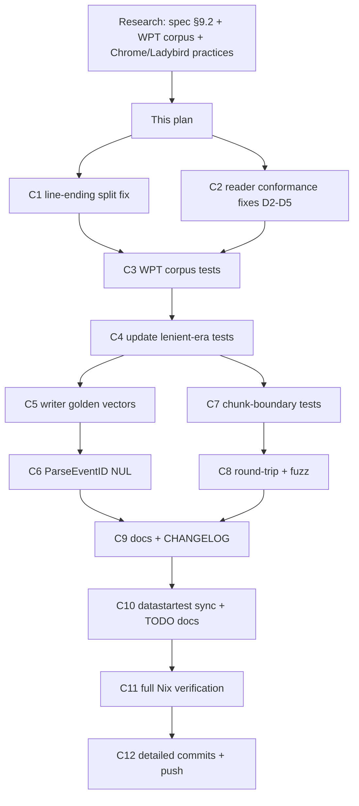

# SUPERB: Spec-Based Hardcore SSE Conformance Testing

**Date:** 2026-08-16 09:21
**Status:** DONE (2026-08-16) — execution report: [docs/status/2026-08-16_10-14_sse-spec-conformance-execution.md](../status/2026-08-16_10-14_sse-spec-conformance-execution.md)
**Goal:** Make go-sse provably conformant to the WHATWG HTML Living Standard § 9.2 (Server-Sent Events) by transcribing the official Web Platform Tests (WPT) corpus into executable Go tests — and fixing every deviation it exposes.

---

## 1. Research Summary (what we learned)

- **The spec:** WHATWG HTML Living Standard § 9.2 — https://html.spec.whatwg.org/multipage/server-sent-events.html. Not an RFC.
- **The official test suite:** Web Platform Tests, `eventsource/` directory — https://github.com/web-platform-tests/wpt/tree/master/eventsource. Each `format-*.any.js` is a browser test: it spins a server (`resources/message.py`), feeds bytes to `EventSource`, asserts dispatched events. **Not runnable as-is against Go** — but each contains a precise (input wire bytes → expected events) pair we can transcribe.
- **How Chrome tests it:** pure unit tests for the wire codec (`event_source_parser_test.cc`, ~20 cases incl. byte-by-byte feeding, id persistence, retry digit rules) + layout tests + WPT in CI. No fuzzer.
- **How Ladybird tests it:** zero in-tree EventSource tests; nightly full-WPT runs on a dedicated server only.

### Deviations found in OUR code (verified against spec + WPT sources)

| # | Component | Deviation | Spec rule | WPT evidence |
|---|-----------|-----------|-----------|--------------|
| D1 | `ssetest/reader.go` | Lone CR (`\r`) is not treated as a line terminator (bufio.ScanLines only splits LF, strips ≤1 trailing CR) | §9.2.5 ABNF: `end-of-line = cr lf / cr / lf` | `format-newlines`, `format-leading-space`, `format-comments`, `format-field-parsing` |
| D2 | `ssetest/reader.go` | Incomplete final frame at EOF is dispatched | §9.2.6: "Once the end of the file is reached, any pending data must be discarded" | `format-data-before-final-empty-line` |
| D3 | `ssetest/reader.go` | Leading UTF-8 BOM not stripped (poisons first field name) | §9.2.6: UTF-8 decode strips **one** leading BOM | `format-bom`, `format-bom-2` |
| D4 | `ssetest/reader.go` | `id` field containing NUL is accepted | §9.2.6: "If the field value does not contain U+0000 NULL, then set the last event ID buffer... Otherwise, ignore the field" | `format-field-id-null` |
| D5 | `ssetest/reader.go` | Last-event-ID is per-frame, not sticky: a frame without `id:` reports empty ID instead of the last seen ID; an id-only frame's ID never reaches the next dispatched event | §9.2.6 dispatch step 1: last event ID string persists until next `id` field; Chromium pins this (`LastEventIdShouldNotBeReset`, `LastEventIdCanBeUpdatedEvenWhenDataIsEmpty`) | `format-field-id`, `format-field-id-2` |
| D6 | `event.go` | `ParseEventID` rejects `\n`/`\r` but not NUL | §9.2.4: Last-Event-ID value space excludes "U+0000 NULL, U+000A LF, or U+000D CR" | spec text |

Also verified-correct (pinned by new tests so they stay correct): case-sensitive field names, single-space strip after colon (not tab), no-colon lines, unknown fields ignored, comments ignored, retry ASCII-digits-only with leading zeros, retry persistence (bogus retry does not reset a previous valid one), UTF-8 passthrough, data-buffer trailing-newline stripping, empty-`data:` events dispatching with empty payload.

---

## 2. Pareto Breakdown

### The 1% that delivers 51%
**Fix the parser to spec + transcribe the WPT format corpus into `ssetest`.** One test file makes the *official suite* run in our CI, and the fixes it forces (D1–D5) are real conformance bugs: today `ssetest` mis-parses what every real browser correctly parses (CR-terminated streams, BOM'd streams, sticky IDs) and leniently accepts what browsers drop (trailing incomplete frames). A consumer test helper that disagrees with browsers is worse than no helper.

### The 4% that deliver 64%
**Writer golden vectors straight from §9.2.6 + chunk-boundary independence.** The writer is the library's actual product; spec examples (ticker stream, four-block stream, `data:test` ≡ `data: test`) are free, authoritative golden files. The 1-byte-at-a-time reader test (Chromium's `EnqueueOneByOne` trick) proves the parser is independent of TCP chunking — especially vital once we own a stateful split function (D1).

### The 20% that deliver 80%
**Round-trip property test (WriteEvent → ReadEvents → identity), extended fuzz seeds with WPT vectors, `ParseEventID` NUL rejection (D6), docs/CHANGELOG/AGENTS updates.** Round-trip closes the loop: everything we write must be exactly what browsers read. Fuzz seeds keep regressions discoverable forever.

### The other 80% → 100%
Sync the dispatch-rule fixes to `datastartest` (mandated by AGENTS.md when dispatch rules change), update TODO_LIST/FEATURES, full Nix verification, detailed commit + push.

---

## 3. Comprehensive Plan (coarse tasks, 10–30 min)

| ID | Task | Why (customer value) | Impact | Effort | Tier |
|----|------|----------------------|--------|--------|------|
| C1 | Fix D1: spec-conformant line split (CR/LF/CRLF) via custom bufio SplitFunc in `ssetest/reader.go` | Parser reads what browsers read | Critical | M | 1% |
| C2 | Fix D2–D5 in `ssetest/reader.go`: EOF discard, BOM strip-once, NUL-id ignore, sticky last-ID, retry 64-bit | Parser reads what browsers read | Critical | M | 1% |
| C3 | Transcribe WPT corpus → `ssetest/wpt_format_corpus_test.go` (~16 named cases, each with upstream URL) | Official suite runs in our CI | Critical | M | 1% |
| C4 | Update existing tests that pin old lenient behavior (`reader_test.go`, fuzz seeds, e2e fallout) | Suite must be green and honest | Critical | S | 1% |
| C5 | Root writer spec tests: `event_spec_test.go` with §9.2.6 golden vectors + Chromium unit-case names | The writer is the product; spec examples are free goldens | High | S | 4% |
| C6 | Fix D6: `ParseEventID` rejects NUL; update tests + error message | Spec §9.2.4 value space | High | S | 20% |
| C7 | Chunk-boundary independence tests: 1-byte reader over the whole corpus (Chromium `EnqueueOneByOne`) | TCP chunking must not change results | High | S | 4% |
| C8 | Round-trip tests: `WriteEvent` → `ReadEvents` → identity (table + fuzz) | Prove writer and parser agree | High | S | 20% |
| C9 | Docs: `reader.go` doc comment, `ssetest/README.md`, root `AGENTS.md` gotchas, `CHANGELOG.md` | Future sessions must know the contract changed | High | S | 20% |
| C10 | Sync dispatch fixes to `datastartest` (if repo is local); update TODO_LIST/FEATURES | AGENTS.md mandate; no split brain | Med | M | 80% |
| C11 | Full verification: `nix run .#test-race`, `.#vet`, `.#lint`, `nix flake check` | Prove nothing broke | Critical | S | 100% |
| C12 | Detailed commits + push | Ship it | Critical | S | 100% |

## 4. Fine-Grained Breakdown (≤12 min per task)

| ID | Task | Parent | Est |
|----|------|--------|-----|
| F1 | Write `splitSSELines` SplitFunc (CR/LF/CRLF), unit test | C1 | 12m |
| F2 | Wire split func into `newSSEScanner`; remove ScanLines | C1 | 5m |
| F3 | Strip one leading BOM in Read paths; test with bom + bom-2 vectors | C2 | 10m |
| F4 | NUL-id ignore + sticky last-ID buffer (update on id line, reset on empty, attach at dispatch) | C2 | 12m |
| F5 | EOF discard: remove post-loop `dispatchFrame` in ReadEvents + ReadNEvents | C2 | 6m |
| F6 | retry ParseUint → 64-bit; pin leading-zeros + bogus-persistence vectors | C2 | 6m |
| F7 | Corpus file skeleton + Event-expectation helpers | C3 | 10m |
| F8 | Transcribe format-field-* vectors (data, event, event-empty, id-null, parsing, retry, retry-bogus, retry-empty, unknown) | C3 | 12m |
| F9 | Transcribe format-newlines, format-leading-space, format-comments, format-utf-8, format-bom, format-bom-2, format-null-character, format-data-before-final-empty-line | C3 | 12m |
| F10 | Transcribe spec §9.2.6 in-spec example streams (four-block stream, two-identical-events, empty-data blocks) | C3 | 10m |
| F11 | Flip `TestReadEvents_NoTrailingBlankLine`; sweep e2e/collect tests for EOF/ID assumptions | C4 | 10m |
| F12 | Extend `FuzzReadEvents` seeds with WPT vectors + sticky-id/BOM invariants | C4 | 8m |
| F13 | `event_spec_test.go`: golden writer vectors (ticker, multi-line, id, retry, empty data, CRLF normalization) | C5 | 12m |
| F14 | `ParseEventID` NUL rejection + tests | C6 | 8m |
| F15 | oneByteReader helper + corpus-wide chunk test | C7 | 10m |
| F16 | Round-trip table test in ssetest (root Event → wire → ssetest Event) | C8 | 12m |
| F17 | Fuzz round-trip property (generated events) | C8 | 10m |
| F18 | Docs sweep: reader.go doc, ssetest README, AGENTS.md, CHANGELOG entry | C9 | 12m |
| F19 | datastartest sync (conditional on local clone) | C10 | 12m |
| F20 | TODO_LIST/FEATURES update | C10 | 8m |
| F21 | `nix run .#test-race` + `.#vet` + `.#lint` + `nix flake check` | C11 | 12m |
| F22 | Commits (parser fixes / corpus / writer+id / docs) + push | C12 | 12m |

## 5. Execution Graph

## 6. Safety / Non-Goals

- **No API signature changes.** All fixes are behavioral corrections inside existing functions; `ssetest.Event` fields keep names/semantics visible to consumers (ID becomes sticky per spec — documented as breaking-ish in CHANGELOG).
- **No retry/backoff, no WebSocket, no CQRS** — out of scope per AGENTS.md.
- Existing green tests stay green except those that pinned *spec-incorrect* behavior (F11) — each flip is justified by a spec citation in the test comment.
- The auto-git daemon may commit mid-flight; we never revert its commits.

## 7. Verification Criteria (definition of done)

1. All WPT `format-*` wire-format vectors pass as Go tests.
2. Spec §9.2.6 example streams pass as parser goldens and writer goldens.
3. `nix run .#test-race`, `.#vet`, `.#lint`, `nix flake check` all green.
4. CHANGELOG + AGENTS.md document the conformance changes; datastartest synced or noted.
5. Detailed commit(s) pushed.
