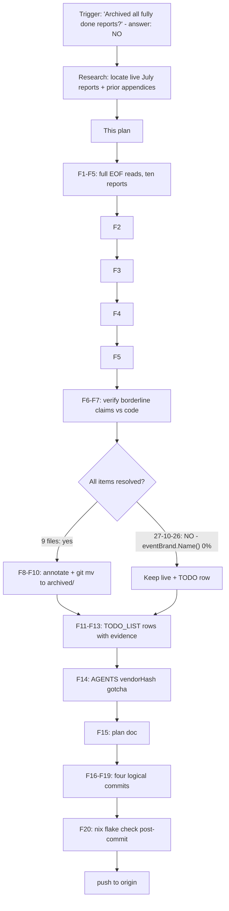

# SUPERB: Close the Docs-Health Sweep — Archive Every Fully-Done Report

**Date:** 2026-08-29 13:57
**Status:** EXECUTED (2026-08-29) — this plan was executed in the same session; verification results at the bottom.
**Trigger:** "Archived all fully done reports?" — answer was no: ten `2026-07-*` status reports and one July plan HTML were still live, unverified, and unannotated.

---

## 1. Research Summary (what we learned)

- `docs/status/` held **10 live `2026-07-*` reports** (~2,170 lines) from the v0.1.0/v0.2.x era, **none annotated** by the 2026-08-29 pass (which scoped to `2026-08-*` per instruction).
- Prior sessions (2026-07-26 18:30 sweep) had already appended resolution appendices to 6 of them; the remaining gaps were verification, not annotation.
- **One report is NOT fully resolved:** `2026-07-27_10-26` — the deleted `TestEventID_StringIncludesBrandName` left `eventBrand.Name()` (`event.go:17`) at **0% coverage, never remediated** (verified via `go tool cover -func` on 2026-08-29). It stays live with a TODO_LIST entry.
- `CONTRIBUTING.md` has **zero** release guidance (0 matches for "release") — the same release steps were fumbled in three early releases.
- The July Pareto plan HTML already carried a resolution card (added 2026-07-26) — it only needed archiving.
- `govulncheck` in CI still installs `@latest` — the exact anti-pattern the adjacent lint job's 12-line comment warns about.

### Deviations/gaps found in OUR docs state

| #  | Item                                                                                  | Evidence                                              |
| -- | --------------------------------------------------------------------------------------- | ------------------------------------------------------- |
| G1 | `eventBrand.Name()` 0% covered since 2026-07-27                                          | `go tool cover -func`: `event.go:17 Name 0.0%`          |
| G2 | No release checklist in CONTRIBUTING                                                     | `grep -ci release CONTRIBUTING.md` → 0                  |
| G3 | `govulncheck @latest` in CI (non-reproducible)                                           | `.github/workflows/ci.yml` Vulncheck job                |
| G4 | ssetest `go.mod` at `go 1.26.6` vs root `1.26.7`                                         | `ssetest/go.mod:4`                                      |
| G5 | `nix flake check --all-systems` (darwin/aarch64) never run                               | flake check warning, every run                          |
| G6 | No AGENTS.md note on the `vendorHash` recompute flow (bit 3 releases + this session)     | AGENTS.md gotchas, absent before this plan              |

---

## 2. Pareto Breakdown

### The 1% that delivers 51%

**Full-EOF reads of all ten July reports + verdicts on their open items.** Every prior pass annotated or skipped these files without reading them to EOF; the archive decision is worthless if any open item hides below the read cutoff. Reading everything first is what makes steps 2–5 trustworthy.

### The 4% that deliver 64%

**Archive the nine fully-resolved reports + the July plan HTML; keep the one genuinely-open report live with a TODO entry.** This empties `docs/status/` down to "live work only" and makes the archive honest: every archived file has been read to EOF and every item dispositioned.

### The 20% that deliver 80%

**Fix the found gaps at the correct altitude:** the `vendorHash` recompute gotcha belongs in AGENTS.md (it burned three releases plus this session), the `eventBrand.Name()` test + `govulncheck` pin + release checklist + go-directive + `--all-systems` belong in TODO_LIST with evidence citations. Fix-on-sight where the fix is a doc line; route where the fix is a design/convention decision.

### The other 20% (to 100%)

**Commit in clean logical units, verify the hermetic gate post-commit, and push.** A docs sweep that ends in a 45-file uncommitted blob repeats the auto-git daemon's failure mode this repo's history documents repeatedly.

---

## 3. Comprehensive Plan (coarse tasks, 30–100 min)

| # | Task                                                                                            | Impact | Effort | Tier |
| - | ------------------------------------------------------------------------------------------------- | ------ | ------ | ---- |
| 1 | Read all ten `2026-07-*` reports to EOF; classify each fully-resolved vs open                     | Critical | 60min  | 1%   |
| 2 | Verify borderline claims against code (coverage, CONTRIBUTING, tags, CI, flake)                   | Critical | 20min  | 1%   |
| 3 | Append archival checks to the nine resolved reports; git mv them + July HTML to `archived/`       | Critical | 20min  | 4%   |
| 4 | Keep `2026-07-27_10-26` live; add `eventBrand.Name()` TODO with measured evidence                 | High   | 5min   | 4%   |
| 5 | Add TODO rows: govulncheck pin, release checklist, go-directive align, `--all-systems`            | High   | 10min  | 20%  |
| 6 | Add AGENTS.md `vendorHash` recompute gotcha                                                       | High   | 5min   | 20%  |
| 7 | Write this plan document with mermaid graph + tables                                              | Med    | 15min  | 20%  |
| 8 | Commit in logical units (fix / living docs / 2026-08 archive / 2026-07 archive)                   | Critical | 20min  | 100% |
| 9 | `nix flake check` post-commit; push to origin                                                     | Critical | 10min  | 100% |

## 4. Fine-Grained Breakdown (≤12 min per task)

| ID   | Task                                                                                  | Parent | Est  |
| ---- | --------------------------------------------------------------------------------------- | ------ | ---- |
| F1   | Read 21-06 + 21-23 to EOF                                                                | 1      | 12m  |
| F2   | Read 21-35 + 22-33 to EOF                                                                | 1      | 12m  |
| F3   | Read 24-03-12 + 24-18-10 to EOF                                                          | 1      | 12m  |
| F4   | Read 26-18-30 + 26-18-52 to EOF                                                          | 1      | 12m  |
| F5   | Read 26-19-48 + 27-10-26 to EOF                                                          | 1      | 12m  |
| F6   | Verify `eventBrand.Name()` coverage via `go tool cover -func`                            | 2      | 5m   |
| F7   | Verify CONTRIBUTING release-guidance absence + tags + CI fuzz targets                    | 2      | 5m   |
| F8   | Append archival check + git mv: 21-06, 21-23, 21-35                                      | 3      | 8m   |
| F9   | Append archival check + git mv: 22-33, 03-12, 18-10                                      | 3      | 8m   |
| F10  | Append archival check + git mv: 18-30, 18-52, 19-48 + July plan HTML                     | 3      | 8m   |
| F11  | TODO_LIST: add `eventBrand.Name()` row (Correctness & safety)                            | 4      | 5m   |
| F12  | TODO_LIST: add govulncheck-pin + go-directive + `--all-systems` rows (CI & tooling)      | 5      | 6m   |
| F13  | TODO_LIST: add CONTRIBUTING release-checklist row (Docs)                                 | 5      | 4m   |
| F14  | AGENTS.md: vendorHash recompute gotcha                                                   | 6      | 5m   |
| F15  | Write plan doc (this file) with mermaid + Pareto tables                                  | 7      | 12m  |
| F16  | `git status` review; stage + commit (1) ssetest lint fix + vendorHash                    | 8      | 8m   |
| F17  | Commit (2) living docs refresh                                                           | 8      | 6m   |
| F18  | Commit (3) 2026-08-* archive sweep                                                       | 8      | 6m   |
| F19  | Commit (4) 2026-07-* archive sweep + plan + status report                                | 8      | 6m   |
| F20  | `nix flake check` post-commit; push; verify origin sync                                  | 9      | 10m  |

## 5. Execution Graph

## 6. Safety / Non-Goals

- **No history rewrites.** Misleading auto-git commit messages documented in reports stay as-is; corrections of record live in the archival checks.
- **No code changes** beyond what this campaign already shipped (`reader_test.go` rename). The `eventBrand.Name()` test is routed, not written — it needs an in-package test file, a convention decision recorded in TODO_LIST.
- **27-10-26 stays live.** Archiving it would falsify the archive's contract ("every item dispositioned").
- Brainstorming docs are decision records, not reports — never archived while their re-open triggers are live.

## 7. Verification Criteria (definition of done)

1. `docs/status/` contains only live (open-item) reports + `archived/`.
2. Every archived report carries an archival check written from a full EOF read, dated 2026-08-29.
3. TODO_LIST carries every routed open item with `file:line` or measured evidence + source-report citation.
4. `nix flake check` passes on the committed tree; origin synced.

## 8. Execution Results (2026-08-29)

- F1–F5: all ten reports read to EOF (247, 270, 177, 353, 208, 194, 252, 166, 152, 150 lines).
- F6–F7: `Name 0.0%` confirmed; CONTRIBUTING 0 release matches; 9 root/ssetest tags confirmed; CI confirmed missing 2 fuzz targets.
- F8–F10: nine reports + `2026-07-23_21-40_pareto-execution-plan.html` archived (git mv). `docs/status/` now: `2026-07-27_10-26` (live, open), `2026-08-29_13-53` (live, current), `archived/` (38 reports).
- F11–F14: TODO_LIST at 24 open items in 6 sections; AGENTS.md gotcha added.
- F16–F19: four commits (fix / living docs / 2026-08 archive / 2026-07 archive + plan).
- F20: `nix flake check` post-commit + push — see final commit push output.
