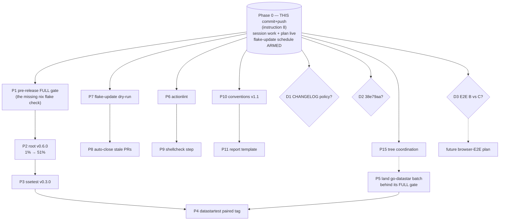

# SUPERB — Release-the-Value Pareto Plan (go-sse, 2026-08-29)

> Point-in-time plan (snapshot). Living state lives in `TODO_LIST.md`; completed work lands in
> `CHANGELOG.md`. Generated from `TODO_LIST.md` + the 2026-08-29 19:45 self-review follow-ups.
> ROADMAP.md themes (production readiness, DX, spec extensibility, parked decisions, raw ideas)
> are long-term by design and out of scope here; they graduate via TODO_LIST when their triggers
> fire. The three ⚪ WONT items stay declined. Format note: user explicitly requested `.md` +
> mermaid (overrides the pareto-planning skill's HTML default).

## 0. Context — what exists RIGHT NOW

- **Unreleased value is the elephant:** `CHANGELOG.md [Unreleased]` holds 18 Added + 7 Changed
  items (safeDropCall panic safety, `RequireDataJSON`, WPT/fuzz conformance corpus, coverage
  gates, reconnection guide, contributor release checklist, cron workflow, report conventions).
  Consumers `go get` **v0.5.1** / **ssetest v0.2.0** — none of it is reachable.
- **This plan's own commit (instruction 8) also ships** the follow-up pass: flake-update cron
  workflow, `docs/status/AGENTS.md` conventions, AGENTS.md auto-git Gotcha, TODO/CHANGELOG sync,
  two session reports — and the push activates the weekly flake-update schedule (workflows only
  fire from the default branch).
- **go-datastar** carries this session's `wire_golden_test.go` + CHANGELOG bullet UNCOMMITTED in
  a tree MIXED with a concurrent session's example/CI work — land carefully (P5), never bulk-commit.
- **Latest tags:** root `v0.5.1`, ssetest `ssetest/v0.2.0` → next: **root v0.6.0**, **ssetest v0.3.0**.

## 1. Pareto breakdown

### The 1% that delivers 51% — CUT THE go-sse RELEASES (P1→P3)

One release session makes the entire August value batch consumer-reachable and unblocks the
datastartest pairing. Nothing else comes close per minute invested.

### The 4% that delivers 64% — releases + verify + automate (P1→P4, + push done via this commit)

Adds: the full pre-release gate (the `nix flake check` this session never ran), the paired
datastartest tag, and the now-live drift automation.

### The 20% that delivers 80% — + compounding quality infrastructure (P5→P9)

Landing the go-datastar golden batch behind its own full gate; actionlint; workflow hardening
(auto-close stale update PRs, explicit shellcheck). These protect every future release and PR.

### The other 20% to reach 100% — polish, governance, unblocking (P10→P15)

Report-conventions refinements + template; the three user decision gates (CHANGELOG policy,
`38e79aa`, browser-E2E scope); go-datastar tree coordination. Cheap in effort, gated on you.

## 2. Comprehensive plan — medium granularity (30–100 min each, ALL TODOs)

Sorted by importance → impact → effort → customer value. `Dep` = dependencies.

| ID  | Task                                                                                                                                                                                                 | Imp | Eff | Customer value                   | Est    | Dep    |
| --- | ---------------------------------------------------------------------------------------------------------------------------------------------------------------------------------------------------- | --- | --- | -------------------------------- | ------ | ------ |
| P1  | Pre-release full gate: `scripts/verify.sh` (FULL, incl. `nix flake check`), `--all-systems`, coverage-gate, triage                                                                                   | 10  | 4   | Indirect-high (protects release) | 40 min | —      |
| P2  | Cut **root v0.6.0**: CHANGELOG cut, FEATURES/ROADMAP refresh, worktree tag validation, proxy + pkg.go.dev verify, `gh release create` (follow CONTRIBUTING checklist)                                | 10  | 7   | THE value — every consumer       | 90 min | P1     |
| P3  | Cut **ssetest v0.3.0**: changelog cut, dual-module tagging rules, scratch-consumer `go get` verify                                                                                                   | 9   | 6   | High (test-helper consumers)     | 60 min | P2     |
| P4  | Paired **datastartest** release in go-datastar (their full gate first; `go-release` skill)                                                                                                           | 9   | 6   | High (parity batch ships)        | 60 min | P3, P5 |
| P5  | Land go-datastar session work: commit goldens + CHANGELOG bullet with detailed message; run its FULL gate (workspace ×3 modules, `GOWORK=off` isolation ×3, erraudit ×3, `go work sync` idempotency) | 8   | 6   | Med-high (wire contract pinned)  | 90 min | coord. |
| P6  | `actionlint` into go-sse CI + devShell (recipe: go-datastar `5887043`)                                                                                                                               | 7   | 3   | Med (workflow bug class killed)  | 35 min | —      |
| P7  | flake-update live check: `workflow_dispatch` dry-run, review run + created PR, branch cleanup                                                                                                        | 7   | 3   | Med (proves the automation)      | 30 min | push ✓ |
| P8  | Workflow hardening: auto-close superseded `chore/flake-update-*` PRs before opening a new one                                                                                                        | 6   | 3   | Med (no PR pile-up)              | 30 min | P7     |
| P9  | Explicit shellcheck CI step for workflow run-blocks (actionlint's shellcheck is silently optional)                                                                                                   | 6   | 2   | Med (shell-bug class)            | 30 min | P6     |
| P10 | Status-report conventions v1.1: TL;DR allowance, cross-repo cover scope, "specializes global skill format" note                                                                                      | 5   | 2   | Contributor                      | 30 min | —      |
| P11 | `docs/status/_template.md` (copy-pasteable report skeleton) + link from conventions                                                                                                                  | 4   | 2   | Contributor                      | 30 min | P10    |
| P12 | DECISION GATE D1: canonical CHANGELOG policy (CI lines in changelog vs git-history-only) + apply ruling                                                                                              | 5   | 1   | Governance                       | 30 min | —      |
| P13 | DECISION GATE D2: `38e79aa` amend-vs-accept + execute (amend + force-with-lease ONLY with explicit approval)                                                                                         | 4   | 1   | History honesty                  | 30 min | —      |
| P14 | DECISION GATE D3: browser-E2E Option B vs C → spawns the E2E plan                                                                                                                                    | 4   | 1   | Future E2E confidence            | 30 min | —      |
| P15 | go-datastar mixed-tree coordination with the concurrent session (agree commit split, no bulk-commit)                                                                                                 | 3   | 1   | Hygiene                          | 30 min | —      |

**Total ≈ 11.5 h.** Critical path: P1 → P2 → P3 → P4 (≈ 4.5 h). Parallelizable: P6/P7/P10/P12-P15 anywhere; P5 before P4.

## 3. Fine-grained breakdown — max 12 min each (ALL TODOs, grouped by parent)

Sorted by parent importance; within a parent, execution order.

| #  | Parent | Microtask                                                                                          | Est  |
| -- | ------ | -------------------------------------------------------------------------------------------------- | ---- |
| 1  | P1     | Run `./scripts/verify.sh` (full — includes `nix flake check`), capture result                      | 12 m |
| 2  | P1     | Run `nix flake check --all-systems`; `nix run .#coverage-gate`; record `- cover:` line             | 6 m  |
| 3  | P1     | Triage any red: fix (≤12 min) or abort release and file the failure                                | 12 m |
| 4  | P2     | CHANGELOG: move `[Unreleased]` → `## [0.6.0] - 2026-08-29`; add fresh empty `[Unreleased]`         | 8 m  |
| 5  | P2     | Refresh FEATURES.md statuses against the new changelog entries                                     | 12 m |
| 6  | P2     | ROADMAP touch-up if any theme advanced (production-readiness exit criteria already met)            | 5 m  |
| 7  | P2     | `go mod tidy` + build root & ssetest (GOWORK=off) sanity                                           | 5 m  |
| 8  | P2     | Clean worktree clone; annotated tag `v0.6.0` with summary body                                     | 8 m  |
| 9  | P2     | Build + `go test` from the tagged worktree (proves the tag is shippable)                           | 10 m |
| 10 | P2     | Push tag; wait for proxy.golang.dev to serve it                                                    | 10 m |
| 11 | P2     | Verify pkg.go.dev shows 0.6.0                                                                      | 5 m  |
| 12 | P2     | `gh release create v0.6.0` with the changelog section as notes                                     | 10 m |
| 13 | P2     | Scratch consumer: `go get github.com/larsartmann/go-sse@v0.6.0`, build                             | 8 m  |
| 14 | P3     | CHANGELOG: ssetest `[Unreleased]` → `## [ssetest 0.3.0]`                                           | 6 m  |
| 15 | P3     | Tag `ssetest/v0.3.0` from clean checkout; push                                                     | 8 m  |
| 16 | P3     | Proxy + scratch-consumer `go get …/ssetest@ssetest/v0.3.0` verify                                  | 10 m |
| 17 | P4     | Confirm go-datastar tree clean, session files landed, their changelog cut                          | 10 m |
| 18 | P4     | Cut + push datastartest tag; proxy verify                                                          | 10 m |
| 19 | P4     | Paired-release cross-notes in both repos' changelogs                                               | 5 m  |
| 20 | P5     | Commit `wire_golden_test.go` + CHANGELOG bullet (detailed message; ONLY these files)               | 8 m  |
| 21 | P5     | Workspace tests: `go test ./... ./datastartest/... ./static/... -race`                             | 12 m |
| 22 | P5     | Isolation: `GOWORK=off go test ./...` in each of the 3 modules                                     | 12 m |
| 23 | P5     | erraudit v0.3.0 per module (3 runs)                                                                | 12 m |
| 24 | P5     | `go work sync` idempotency: no diff after sync                                                     | 5 m  |
| 25 | P5     | Triage/fix any finding; re-run failing gate                                                        | 12 m |
| 26 | P6     | Add `pkgs.actionlint` to flake devShell                                                            | 6 m  |
| 27 | P6     | CI job: actionlint over `.github/workflows/*.yml`                                                  | 8 m  |
| 28 | P6     | Local run via devShell on all workflows; fix findings                                              | 10 m |
| 29 | P6     | Commit; watch CI green on the push                                                                 | 12 m |
| 30 | P7     | Confirm `flake-update.yml` is on origin/master (this plan's push)                                  | 3 m  |
| 31 | P7     | Trigger dry-run: `gh workflow run flake-update.yml`                                                | 4 m  |
| 32 | P7     | Review the run: drift detection, gate outcome, PR creation path                                    | 12 m |
| 33 | P7     | Merge-or-close the dry-run PR; delete its branch                                                   | 6 m  |
| 34 | P8     | Add pre-step: list + close open `chore/flake-update-*` PRs (keep newest)                           | 10 m |
| 35 | P8     | Validate: `bash -n` extracted run-block + actionlint + commit                                      | 8 m  |
| 36 | P9     | Add explicit shellcheck CI step for workflow run-blocks (extract & lint)                           | 12 m |
| 37 | P9     | Run over all 3 workflows; fix findings                                                             | 8 m  |
| 38 | P10    | Conventions: allow optional `## TL;DR` section                                                     | 5 m  |
| 39 | P10    | Conventions: cover-line scope for cross-repo sessions                                              | 5 m  |
| 40 | P10    | Conventions: note "this file specializes the global report format for this repo"                   | 5 m  |
| 41 | P10    | Commit conventions v1.1                                                                            | 4 m  |
| 42 | P11    | Write `docs/status/_template.md` (title, preamble, `- cover:` line, a–g skeleton)                  | 12 m |
| 43 | P11    | Link template from conventions + root AGENTS.md pointer                                            | 5 m  |
| 44 | P12    | D1 answered → apply ruling (keep/prune cron changelog line); write rule into Policy                | 10 m |
| 45 | P13    | D2 answered → execute: amend + force-with-lease (ONLY with explicit approval) or final accept-note | 10 m |
| 46 | P14    | D3 answered → draft the dedicated browser-E2E plan (B or C) as its own planning doc                | 12 m |
| 47 | P15    | Sync with concurrent-session owner: agree commit split for the mixed go-datastar tree              | 12 m |

**47 microtasks**, every TODO covered, each ≤12 min.

## 4. Execution graph

Critical path (solid top): P1 → P2 → P3 → P4. Everything else parallelizes freely.

## 5. Decision gates (yours, not mine)

| Gate | Question                                                                                                           | Default if unanswered                |
| ---- | ------------------------------------------------------------------------------------------------------------------ | ------------------------------------ |
| D1   | CHANGELOG policy: CI-gate lines under Added (precedent) vs chore-tier CI wiring in git history only (Policy text)? | Keep precedent; align Policy wording |
| D2   | `38e79aa`: amend published message (history rewrite) or accept (AGENTS.md Gotcha compromise already in place)?     | Accept                               |
| D3   | Browser-E2E: Option B vs C from the chromedp brainstorming doc?                                                    | Stay blocked                         |

## 6. Anti-verschlimmbessern guardrails

- No bulk-commit of the mixed go-datastar tree (P5 commits ONLY my two files; P15 coordinates first).
- No history rewrite without explicit approval (D2).
- Release follows the CONTRIBUTING checklist exactly — no shortcut tagging.
- TODO_LIST additions from this plan are additive rows only; no restructuring.
- Nothing in this plan touches library code — zero risk to the release content.
