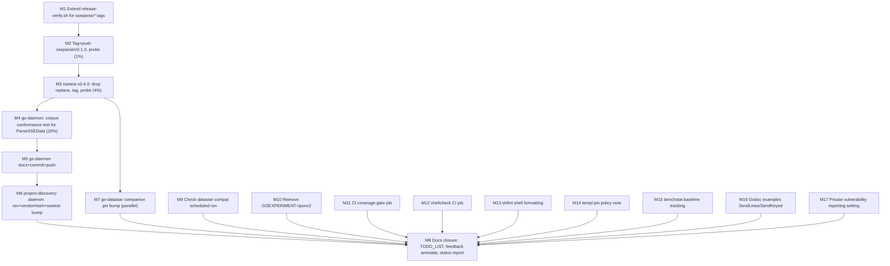

# SUPERB Plan — sseparse Release + go-daemon Adoption

**2026-09-29 01:48 CEST** · go-sse `master` @ `64238f7` (clean, pushed) ·
Sister-repo plan: also touches `go-daemon`, `project-discovery-daemon`, `go-datastar`.

## Context — why this plan exists

The 2026-09-29 go-daemon feedback (`docs/feedback/new/2026-09-29_ssetest-gaps-blocking-go-daemon-adoption.md`)
was processed the same night (`docs/status/2026-09-29_01-35_sseparse-split-and-corpus-export.md`,
gates green): `sseparse` is a zero-dependency module, the WPT conformance
corpus is exported as data (`Corpus()`/`MustCorpus`, 29 vectors), the reader
API is documented first-class, and the 1 MiB line cap is configurable and
pinned. What shipped is code-complete but **unreleased** — and therefore
unusable by every consumer.

Verified planning-time facts (each checked this session, not assumed):

| Fact | Evidence |
| ---- | -------- |
| `sseparse/v0.1.0` does not exist; latest tag is `v0.6.1` | `git tag -l`, `git ls-remote --tags origin` |
| go-sse is **public** — sseparse will resolve via the public Go proxy | `git ls-remote https://github.com/larsartmann/go-sse HEAD` → `64238f7` unauthenticated |
| `release-verify.sh` does not know `sseparse/*` tags — an `sseparse/` tag falls through to the root-module probe | `scripts/release-verify.sh:19-25` (case only matches `ssetest/*`) |
| ssetest `go.mod` carries `require sseparse v0.1.0` + local `replace => ../sseparse` | `ssetest/go.mod` |
| CHANGELOG `[Unreleased]` already carries the sseparse Added + ssetest breaking entries | `CHANGELOG.md` |
| Primary consumer does NOT use `CodeSSEScanFailed` — ssetest v0.4.0 breaking change is harmless there | `rg CodeSSEScanForecast project-discovery-daemon` → 0 hits (checked `CodeSSEScanFailed`) |
| project-discovery-daemon pins go-daemon by rev (`git+ssh`, rev `aea76d2`), go-sse v0.6.0, ssetest v0.3.0 | `project-discovery-daemon/go.mod:6,20-21`, `flake.nix:34-36` |
| go-daemon has 1 unpushed commit (AGENTS.md pending-adoption note) | `git log @{u}..` → `64fe68a` |
| go-datastar still pins go-sse v0.6.0 / ssetest v0.3.0 (companion-bump rule) | go-sse `TODO_LIST.md` open item 5 |
| Submodule tag convention is `ssetest/vX.Y.Z` → `sseparse/vX.Y.Z` matches | `git tag -l 'ssetest/*'` |

**Mission:** land the release so the module graph fix reaches consumers, make
go-daemon the first external adopter (corpus-driven conformance for its
framing parser), cascade the pins through `project-discovery-daemon` and
`go-datastar`, then close the remaining open repo items to 100%.

## Pareto breakdown

| Tier | Share of result | Tasks |
| ---- | --------------- | ----- |
| **1%** | **51%** | Tag `sseparse/v0.1.0` + push. The single unlock: nothing downstream resolves without it. |
| **4%** | **64%** | + ssetest v0.4.0 release (drop `replace`, probe both tags). Module-graph fix becomes installable for every consumer. |
| **20%** | **80%** | + go-daemon adopts (`MustCorpus` framing projection) and project-discovery-daemon's pins/vendorHash cascade. Conformance guarantee reaches the daemon ecosystem. |
| **rest** | **100%** | go-datastar companion bumps, docs closure (TODO_LIST/feedback annotate), then the remaining open items: datastar-compat run check, GOEXPERIMENT removal, CI coverage-gate/shellcheck/shfmt jobs, templ pin policy, benchstat tracking, godoc examples, vulnerability reporting setting. |

## Execution graph

## Comprehensive plan (30–100 min tasks, sorted by impact/effort/value)

| # | Task | Effort | Priority | Value | Depends |
| - | ---- | ------ | -------- | ----- | ------- |
| M1 | Extend `scripts/release-verify.sh` with an `sseparse/*` case (module path, probe import `sseparse.ReadEvents` over a small wire string), run its dry-run path, gates | 30 min | P0 | unblocks correct release probing | — |
| M2 | Release `sseparse/v0.1.0`: annotated tag on `master` @ `64238f7`+M1, push branch+tag, `scripts/release-verify.sh sseparse/v0.1.0`, fresh temp-module `go get` resolution proof | 30 min | P0 | **the 1%** | M1 |
| M3 | Release `ssetest/v0.4.0`: drop `replace` from `ssetest/go.mod`, `go mod tidy`, full `scripts/verify.sh`, cut CHANGELOG `[Unreleased]` into versioned sections, annotated tag, push, probe `ssetest/v0.4.0` | 45 min | P0 | **the 4%** | M2 |
| M4 | go-daemon adopts: `go get sseparse@v0.1.0` (test-only), new `sse_conformance_test.go` driving `ParseSSEData` over every `MustCorpus` vector (projection: dispatched data payloads vs `Events[].Data`), keep maxEventBytes/large-event tests, investigate any vector failures at the root (CRLF/CR/BOM axes), full gates + `nix build` | 60 min | P0 | **the 20%** | M2 |
| M5 | go-daemon closure: AGENTS.md dependency note → adopted, CHANGELOG entry, commit, push (rev becomes pdd's pin) | 30 min | P1 | pins cascade start | M4 |
| M6 | project-discovery-daemon cascade: flake `go-daemon` rev bump + vendorHash re-derive, `go.mod` ssetest v0.3.0→v0.4.0 (breaking change verified unused), go-sse stays v0.6.0 (root untouched), full gates (`nix flake check`, tests) | 60 min | P1 | conformance inherited | M5, M3 |
| M7 | go-datastar companion: bump go-sse/ssetest pins to v0.6.1/v0.4.0, gates, datastartest tag per CONTRIBUTING step 9 pairing rule | 45 min | P1 | keeps sibling repos paired | M3 |
| M8 | Docs closure across repos: go-sse TODO_LIST statuses → DONE with evidence, feedback file annotate "adopted" with go-daemon commit, cross-repo status report (docs-health ANNOTATE mode, archive per convention) | 30 min | P2 | plan → living docs | M6, M7 |
| M9 | Verify first scheduled `datastar-compat.yml` run (scheduled 2026-09-21 05:00 UTC): `gh run list`, green? close TODO, else triage | 20 min | P2 | proves CI runner env | — |
| M10 | Remove inert `GOEXPERIMENT=jsonv2` (devShell, flake apps, CI, scripts, `.envrc`), gates | 30 min | P3 | TODO-list item, trivial diff | — |
| M11 | CI `coverage-gate` job: port local `nix run .#coverage-gate` thresholds (lib ≥90%, ssetest/sseparse ≥95%) into `ci.yml` | 45 min | P2 | TODO item 14 | — |
| M12 | shellcheck CI job for `scripts/*.sh` | 30 min | P3 | TODO item 15 | — |
| M13 | shfmt (or treefmt shell formatter) for `scripts/*.sh` | 30 min | P3 | TODO item 16 | — |
| M14 | templ CLI pin (`@v0.3.1020`) refresh policy — CONTRIBUTING note or drift check | 15 min | P3 | TODO item 17 | — |
| M15 | Benchmark regression tracking (benchstat vs checked-in baseline) | 60 min | P3 | TODO item 18 | — |
| M16 | Godoc examples for `SendLines`/`SendKeyed` | 30 min | P3 | TODO item 19 | — |
| M17 | Enable GitHub private vulnerability reporting (Settings → Code security; REST rejects it) — manual step for owner | 10 min | P2 | TODO open item 6 | — |

## Fine-grained breakdown (≤12 min tasks, sorted, ALL todos)

| # | Task | Min | From | Depends |
| - | ---- | --- | ---- | ------- |
| F1 | Read `scripts/release-verify.sh` fully; map the `ssetest/*` case shape | 8 | M1 | — |
| F2 | Add `sseparse/*` case: module path + probe (`sseparse.ReadEvents` on `data: hi\n\n`, assert 1 event, data `hi`) | 10 | M1 | F1 |
| F3 | Run release-verify against an untagged ref to confirm the new branch errors correctly; `scripts/verify.sh --fast` | 8 | M1 | F2 |
| F4 | Commit M1 (detailed message), push | 3 | M1 | F3 |
| F5 | Pre-tag gate: `scripts/verify.sh` full → ALL CHECKS PASSED on `master` | 10 | M2 | F4 |
| F6 | Create annotated tag `sseparse/v0.1.0` (message: zero-dep split, corpus export, feedback source) | 5 | M2 | F5 |
| F7 | Push branch + tag; wait for proxy; run `scripts/release-verify.sh sseparse/v0.1.0` | 8 | M2 | F6 |
| F8 | Fresh-consumer proof: temp module, `go get github.com/larsartmann/go-sse/sseparse@v0.1.0`, build+run probe, paste output into report | 10 | M2 | F7 |
| F9 | Drop `replace github.com/larsartmann/go-sse/sseparse => ../sseparse` from `ssetest/go.mod`; `go mod tidy` | 5 | M3 | F8 |
| F10 | `go build ./... && go test ./... -race -count=1` all three modules; `scripts/verify.sh` full | 12 | M3 | F9 |
| F11 | Cut CHANGELOG `[Unreleased]` → `## [ssetest v0.4.0] / [sseparse v0.1.0] - 2026-09-29` sections per policy | 10 | M3 | F10 |
| F12 | Annotated tag `ssetest/v0.4.0` (breaking note: `CodeSSEScanFailed` removed, `%w` wrapping); push; probe both tags | 8 | M3 | F11 |
| F13 | Commit+push M3 leftovers; confirm origin clean | 4 | M3 | F12 |
| F14 | go-daemon: `go get github.com/larsartmann/go-sse/sseparse@v0.1.0`; confirm go.mod/go.sum shape (test-only usage) | 8 | M4 | F8 |
| F15 | Read `MustCorpus` vector shape + go-daemon `sse.go:36` signature; define projection func (vector → []string data payloads) | 10 | M4 | F14 |
| F16 | Write `sse_conformance_test.go`: range vectors, run `ParseSSEData` on `Wire`, compare projected payloads | 12 | M4 | F15 |
| F17 | Run conformance test; triage failures by axis (CRLF, lone CR, BOM, no-dispatch frames, empty data) | 12 | M4 | F16 |
| F18 | Fix root-cause failures in `sse.go` (or, if a vector over-specifies beyond framing-only, document the deliberate divergence inline) | 12 | M4 | F17 |
| F19 | Keep+verify maxEventBytes tests (`sse_test.go` large event, over-cap behavior) | 6 | M4 | F18 |
| F20 | go-daemon gates: `go vet`, `golangci-lint fmt`+`run`, `go test ./... -race`, `nix build` (vendorHash still null-valid?) | 12 | M4 | F19 |
| F21 | Contingency reserve: any corpus/parser mismatch escalation | 12 | M4 | F20 |
| F22 | go-daemon AGENTS.md: dependency note → adopted with version + migration summary | 6 | M5 | F20 |
| F23 | go-daemon CHANGELOG.md entry (new test-only dep, corpus conformance) | 8 | M5 | F22 |
| F24 | Commit go-daemon (detailed), push → rev recorded for M6 | 4 | M5 | F23 |
| F25 | pdd: bump flake input `go-daemon` rev to new master; first `nix build` to surface vendorHash mismatch | 10 | M6 | F24 |
| F26 | pdd: re-derive vendorHash (expected-hash loop), commit flake | 8 | M6 | F25 |
| F27 | pdd: `go get ssetest@v0.4.0`; `go mod tidy`; confirm go-sse stays v0.6.0 | 8 | M6 | F26 |
| F28 | pdd: rg for removed/changed ssetest API (`CodeSSEScanFailed`, error-wrap behavior) in its sources | 6 | M6 | F27 |
| F29 | pdd gates: `nix flake check`, `nix build`, `go test ./... -race` (or repo's flake test app) | 12 | M6 | F28 |
| F30 | pdd: commit+push; capture green evidence for report | 6 | M6 | F29 |
| F31 | go-datastar: locate sse/ssetest pins in go.mod files; `go get` bumps to v0.6.1/v0.4.0 | 10 | M7 | F12 |
| F32 | go-datastar: tidy + build + test both modules | 12 | M7 | F31 |
| F33 | go-datastar: datastartest pairing check per CONTRIBUTING step 9; tag if due | 10 | M7 | F32 |
| F34 | go-datastar: commit+push | 5 | M7 | F33 |
| F35 | go-sse TODO_LIST: release item → DONE (tag hashes + probe output); adoption item → DONE (go-daemon commit) | 8 | M8 | F30 |
| F36 | Annotate feedback file: adopted, with links (non-destructive ANNOTATE, not rewrite) | 6 | M8 | F35 |
| F37 | Cross-repo status report in `docs/status/` (template: gates, covers, tables) | 12 | M8 | F36 |
| F38 | Commit+push docs closure | 5 | M8 | F37 |
| F39 | `gh run list --workflow=datastar-compat.yml`; inspect first scheduled run result | 6 | M9 | — |
| F40 | Green → close TODO item; red → triage log, file follow-up | 10 | M9 | F39 |
| F41 | Grep GOEXPERIMENT across devShell/flake apps/ci/scripts/.envrc | 5 | M10 | — |
| F42 | Remove each inert export; `nix flake check` + fast build | 10 | M10 | F41 |
| F43 | Full verify after GOEXPERIMENT removal; commit+push | 10 | M10 | F42 |
| F44 | Design CI coverage-gate job (nix app vs script; thresholds lib 90, ssetest/sseparse 95) | 10 | M11 | — |
| F45 | Add `coverage-gate` job to `ci.yml`; actionlint | 12 | M11 | F44 |
| F46 | Push branch/PR for CI job; watch first run green; merge | 10 | M11 | F45 |
| F47 | Add shellcheck job for `scripts/*.sh`; fix findings it surfaces | 12 | M12 | — |
| F48 | Watch job green; commit+push | 8 | M12 | F47 |
| F49 | Add shfmt to treefmt/devShell; format `scripts/*.sh` | 10 | M13 | — |
| F50 | Verify `nix fmt` + `nix flake check` cover shell files; commit | 8 | M13 | F49 |
| F51 | Write templ pin policy paragraph in CONTRIBUTING (who bumps, when, how to verify) | 10 | M14 | — |
| F52 | Optional drift-check script note; commit | 5 | M14 | F51 |
| F53 | Capture baseline benchmarks (`go test -bench` output checked into `docs/performance/`) | 12 | M15 | — |
| F54 | Add benchstat compare note/script to CONTRIBUTING | 12 | M15 | F53 |
| F55 | Verify bench runs reproducibly; commit | 10 | M15 | F54 |
| F56 | Write `ExampleSendLines` godoc example | 10 | M16 | — |
| F57 | Write `ExampleSendKeyed` godoc example; `go test` doc-output assertions | 10 | M16 | F56 |
| F58 | Lint+commit examples | 6 | M16 | F57 |
| F59 | Owner manual step: Settings → Code security → enable private vulnerability reporting | 10 | M17 | — |
| F60 | Verify SECURITY.md channel matches enabled setting; close TODO item | 5 | M17 | F59 |

Contingency (unscheduled, use if hit): F21 covers corpus mismatches; if
`sseparse` proxy propagation stalls (public module, first fetch may 404
before the proxy pulls), re-run `release-verify.sh` after `GOPROXY=direct`
warm-up — never hand-edit go.sum around it.

## VERSCHLIMMBESSER guards

- **Tag order is load-bearing**: `sseparse/v0.1.0` must exist and be pushed
  BEFORE the ssetest `replace` is dropped — dropping it first redds every
  build of ssetest. TODO_LIST item 1 prescribes exactly this; do not reorder.
- **Root library stays untouched** — no root `v0.7.0`; do not tag it "while
  we're here".
- **The corpus is the oracle**: if go-daemon's parser disagrees with a
  vector, the default assumption is the parser is wrong (the vectors are
  WPT/Chromium-derived), not the vector. Divergence must be justified
  framing-only-mechanism reasoning, documented inline.
- **No `git reset --hard`, no force-push**; tags are annotated, never
  moved. A botched tag = new patch version, not a re-tag (proxy poisoning).
- **pdd vendorHash loop**: use the expected-hash error, not `autoHash`;
  commit the derived hash.
- **Other sessions' work**: the 01:35 session's output is committed and
  pushed (`64238f7`); this plan builds on it, never rewrites it.

## Verification gates

| Gate | Where | Command |
| ---- | ----- | ------- |
| Pre-tag | go-sse | `scripts/verify.sh` (full) |
| Release probe | go-sse | `scripts/release-verify.sh sseparse/v0.1.0` then `ssetest/v0.4.0` |
| Adoption | go-daemon | `go test ./... -race -count=1`, `go vet ./...`, `golangci-lint run ./...`, `nix build` |
| Cascade | project-discovery-daemon | `nix flake check`, `nix build`, tests |
| Companion | go-datastar | module build+test both modules |
| Closure | go-sse | TODO_LIST statuses carry commit/tag evidence |
