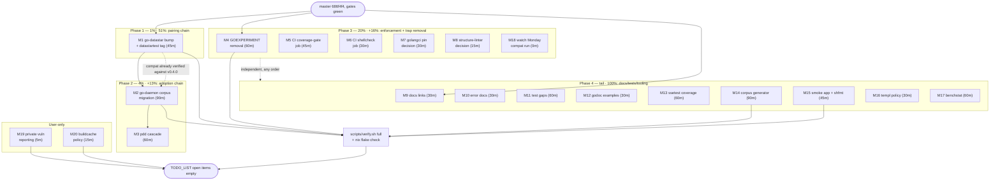

# SUPERB Plan — Consumer Chain Closeout + Repo Hygiene 100%

**2026-09-29 03:45 CEST** · go-sse `master` @ `686f4f4` (clean, this plan
committed separately) · Cross-repo: `go-datastar`, `go-daemon`,
`project-discovery-daemon`.

## Context — why this plan exists

The sseparse split shipped and released tonight (`sseparse/v0.1.0` +
`ssetest/v0.4.0`, commit `7cd5b3a`; release re-verified by the 02:05 pass,
`docs/status/2026-09-29_02-05_sseparse-followup-execution-pass.md`). The
library-side work is done; what remains is the _consumption_ side — the
pairing rule says consumers must be bumped and cascaded — plus a long tail
of small, verified-still-open hygiene items harvested from the 2026-09-19
backlog and the two 2026-09-29 status reports.

Planning-time facts (each verified 2026-09-29 03:40+ CEST, not assumed):

| Fact                                                                                                                                                                                          | Evidence                                                                                            |
| --------------------------------------------------------------------------------------------------------------------------------------------------------------------------------------------- | --------------------------------------------------------------------------------------------------- |
| go-datastar still pins go-sse `v0.6.0` / ssetest `v0.3.0` while `v0.6.1` + `ssetest/v0.4.0` are released — the pairing rule (CONTRIBUTING step 9) is currently open                           | go-datastar `go.mod:8`, `datastartest/go.mod:8-9`; go-sse `git tag -l`                              |
| The datastar-compat bump mechanics are already verified against `ssetest@v0.4.0` — the manual companion bump is de-risked                                                                     | 02:05 pass a)9; `datastartest/go.mod` probe showed `require sseparse v0.1.0 // indirect` auto-added |
| datastartest's tagged `go.mod` still carries inert `replace` directives — the WONT row says drop them AT the next datastartest tag, which is exactly this bump                                | go-sse TODO_LIST "Cross-repo" WONT row; go-datastar `datastartest/go.mod`                           |
| go-daemon is the consumer that requested sseparse (2026-09-29 feedback ask #4) — adoption is unblocked since the release                                                                      | go-sse TODO_LIST open row 1 (UNBLOCKED)                                                             |
| pdd pins go-daemon by rev and ssetest `v0.3.0` — the cascade (rev bump, vendorHash re-derive, ssetest v0.4.0) is pending and is what makes adoption SHIP                                      | TODO_LIST open row 2 (SUPERB 01:48 plan cascade checklist)                                          |
| `GOEXPERIMENT=jsonv2` is verified unnecessary under Go 1.27 but still exported in devShell, flake apps, CI, scripts, .envrc docs                                                              | TODO_LIST open row 3 (AGENTS 2026-09-19 verification)                                               |
| Coverage thresholds (90/95/95) are enforced locally only — CI has no coverage-gate job; `scripts/*.sh` have no shellcheck job; treefmt ignores shell files                                    | TODO_LIST rows 14–16                                                                                |
| 15 small doc/test/tooling items sit in the harvested P2 table, all re-verified still-open on 2026-09-29                                                                                       | TODO_LIST rows 17–31                                                                                |
| Two user-only decisions are parked: private-vulnerability reporting (Settings UI; REST rejects it) and the buildflow `go-structure-linter` gate question (7 findings absorbed every full run) | TODO_LIST open row 6; 01-58 + 02-05 reports §g                                                      |

**Mission:** make the released split _consumed_ — go-datastar on current
pins with a fresh datastartest tag, go-daemon adopted onto corpus vectors,
pdd cascaded — then close every remaining repo item so TODO_LIST reaches a
genuinely empty open-items state, without breaking a single gate.

## Pareto breakdown

| Tier            | Share of result | Tasks                                                                                                                                                                                                                                                       | Why this tier                                                                                                                                                                                                                                                       |
| --------------- | --------------- | ----------------------------------------------------------------------------------------------------------------------------------------------------------------------------------------------------------------------------------------------------------- | ------------------------------------------------------------------------------------------------------------------------------------------------------------------------------------------------------------------------------------------------------------------- |
| **1%**          | **51%**         | **M1: go-datastar companion bump + datastartest release.** ~45 min, closes the only violated cross-repo invariant. Every day open, the compat workflow bumps further ahead of the pairing rule. Compatibility is already verified — this is pure execution. | The flagship consumer becomes current; datastartest's tagged go.mod gets its inert replaces dropped; the pairing chain is whole again.                                                                                                                              |
| **4%**          | **64%**         | 1% **+ M2: go-daemon corpus migration + M3: pdd cascade.** The original customer ask (the feedback that created sseparse) plus the cascade that ships it end-to-end.                                                                                        | sseparse goes from "released" to "adopted by the consumer that requested it, built hermetically by pdd" — the entire reason for the split, realized.                                                                                                                |
| **20%**         | **80%**         | + **M4: GOEXPERIMENT removal, M5: CI coverage-gate job, M6: CI shellcheck job, M7: golangci pin decision, M8: go-structure-linter decision, M18: watch the Monday compat run.**                                                                             | Deletes a documented trap class repo-wide (M4) and moves the two local-only quality gates into CI where they actually bite (M5/M6) — the difference between "green on my machine" and "green by enforcement". Both decisions (M7/M8) close recurring per-run noise. |
| **+20% → 100%** | **100%**        | + **M9–M17:** docs link/error batch, test-gap batch, godoc examples, ssetest coverage push, corpus generator, shfmt, smoke app, templ policy, benchstat. + **M19/M20:** the two user-only actions.                                                          | The long tail: each item is small, all are verified-open, and together they take TODO_LIST to empty.                                                                                                                                                                |

## Comprehensive plan (30–100 min tasks, ALL todos, sorted by impact/effort/value)

| #   | Task (30–100 min)                                                                                                                                           | Covers                  | Repo        | Est   | Impact | Effort | Customer value | Tier |
| --- | ----------------------------------------------------------------------------------------------------------------------------------------------------------- | ----------------------- | ----------- | ----- | ------ | ------ | -------------- | ---- |
| M1  | go-datastar companion bump: pins → go-sse v0.6.1 + ssetest v0.4.0, drop datastartest's inert replaces, test both modules, tag + push datastartest, probe    | TODO 5, WONT-row payoff | go-datastar | 45min | High   | Low    | High           | 1%   |
| M2  | go-daemon: migrate `sse_test.go`'s 10 hand-rolled framing tests to `sseparse.MustCorpus` vectors (framing-only projection: wire → dispatched payloads)      | TODO 1                  | go-daemon   | 90min | High   | Med    | High           | 4%   |
| M3  | pdd cascade: bump go-daemon rev, ssetest v0.3.0→v0.4.0 (verify `CodeSSEScanFailed` unused), `buildflow -s nix-hash-fix --fix`, build + test pdd             | TODO 2                  | pdd         | 60min | High   | Med    | High           | 4%   |
| M4  | Remove inert `GOEXPERIMENT=jsonv2` everywhere (devShell, flake apps, ci.yml, scripts, .envrc pattern, AGENTS/CONTRIBUTING mentions), full gate after        | TODO 3                  | go-sse      | 60min | Med    | Med    | Med            | 20%  |
| M5  | CI coverage-gate job: enforce 90/95/95 on every push (reuse the flake app or plain `go test -cover` + threshold check)                                      | TODO 14                 | go-sse      | 45min | Med    | Low    | Med            | 20%  |
| M6  | CI shellcheck job for `scripts/*.sh` (actionlint's run:-block checking doesn't cover repo scripts)                                                          | TODO 15                 | go-sse      | 30min | Med    | Low    | Med            | 20%  |
| M7  | golangci pin decision: either pin the version in flake.nix (TODO 24) or WONT the row with the verify.sh + flake-update double-check as the recorded control | TODO 24                 | go-sse      | 30min | Med    | Low    | Low            | 20%  |
| M8  | go-structure-linter decision (01-58 §g3): keep absorbing the 7 findings as documented-deliberate, or skip the step in buildflow config for this repo        | g1 question             | go-sse      | 15min | Low    | Low    | Low            | 20%  |
| M9  | Docs links batch: README → four guides (20), AGENTS docs pointer → guides (30), example docs stale port URLs sweep (28)                                     | TODO 20, 28, 30         | go-sse      | 30min | Low    | Low    | Med            | tail |
| M10 | Error-docs batch: document `sse.write_short` in AGENTS conventions + README error list (21); `Stream.Send` doc short-write path (29)                        | TODO 21, 29             | go-sse      | 30min | Low    | Low    | Med            | tail |
| M11 | Test-gaps batch: direct `forEachLine` unit tests (22); `listenAddr()`/PORT override tests for the three examples (23)                                       | TODO 22, 23             | go-sse      | 60min | Low    | Med    | Low            | tail |
| M12 | Godoc examples for `SendLines`/`SendKeyed` (DataStar keyed-line pattern) (19)                                                                               | TODO 19                 | go-sse      | 30min | Low    | Low    | Med            | tail |
| M13 | ssetest coverage 98.0% → push: `collect.go` error paths (closeBody branches and friends) (25)                                                               | TODO 25                 | go-sse      | 60min | Low    | Med    | Low            | tail |
| M14 | Corpus WPT-ingestion generator: decode → extend → re-marshal through the canonical recipe, `go:generate` wired, validator gates stay green (31)             | TODO 31                 | go-sse      | 90min | Low    | Med    | Low            | tail |
| M15 | Tooling symmetry: `nix run .#smoke` flake app wrapping smoke-examples.sh (27); shfmt/treefmt-sh for `scripts/*.sh` + format any drift (16)                  | TODO 16, 27             | go-sse      | 45min | Low    | Low    | Low            | tail |
| M16 | templ CLI pin (`@v0.3.1020`) refresh policy: CONTRIBUTING note + drift check or dependabot caveat documented (17)                                           | TODO 17                 | go-sse      | 30min | Low    | Low    | Low            | tail |
| M17 | Benchmark regression tracking: benchstat baseline + a documented refresh command (18)                                                                       | TODO 18                 | go-sse      | 60min | Low    | Med    | Low            | tail |
| M18 | Watch Monday's `datastar-compat.yml` run (runner-env proof only; mechanics verified) — zero-effort wait-state                                               | TODO 4                  | GitHub      | 5min  | Low    | Triv   | Low            | 20%  |
| M19 | USER: enable GitHub private vulnerability reporting (Settings → Code security; REST rejects it)                                                             | TODO 6                  | GitHub UI   | 5min  | Med    | Triv   | Med            | 20%  |
| M20 | USER: buildcache rotation policy (mount currently 32% — no pressure, decide someday)                                                                        | 01-58 §g1               | host        | 15min | Low    | Triv   | Low            | tail |

## Micro-plan (≤12 min per task, ALL todos, sorted identically)

| #    | Micro-task (≤12 min)                                                                                        | Task |
| ---- | ----------------------------------------------------------------------------------------------------------- | ---- |
| 1.1  | go-datastar: read CONTRIBUTING release checklist + confirm datastartest's current version and replace block | M1   |
| 1.2  | Bump root `go.mod` pins: go-sse v0.6.1; run `go build ./... && go test ./...`                               | M1   |
| 1.3  | datastartest: drop inert `replace` lines, `go get go-sse@v0.6.1 ssetest@v0.4.0`, tidy, build + test         | M1   |
| 1.4  | Cut CHANGELOG entry, commit ("pairing rule: consume go-sse v0.6.1 + ssetest v0.4.0")                        | M1   |
| 1.5  | Tag `datastartest/vX.Y.Z` (annotated, -s/-a policy), push, probe with a scratch consumer                    | M1   |
| 2.1  | go-daemon: read `sse_test.go`, list the 10 framing tests and their wire inputs                              | M2   |
| 2.2  | `go get sseparse@v0.1.0` in go-daemon; decide corpus-vs-existing assertion mapping                          | M2   |
| 2.3  | Migrate framing tests 1–5 to `MustCorpus(t)` range (wire → dispatched payload projection)                   | M2   |
| 2.4  | Migrate framing tests 6–10; delete superseded hand-rolled fixtures                                          | M2   |
| 2.5  | Full go-daemon suite + race; commit "adopt sseparse corpus for framing conformance"                         | M2   |
| 3.1  | pdd: locate go-daemon rev pin (`go.mod` / `flake.nix`), bump to go-daemon's new rev                         | M3   |
| 3.2  | Bump ssetest v0.3.0 → v0.4.0; `rg CodeSSEScanFailed` in pdd (expect 0 hits, per 01:48 plan)                 | M3   |
| 3.3  | `buildflow -s nix-hash-fix --fix` for the vendorHash drift; `nix build` green                               | M3   |
| 3.4  | pdd test suite green; commit + push                                                                         | M3   |
| 4.1  | Grep all `GOEXPERIMENT=jsonv2` exports (flake.nix, ci.yml, scripts/*.sh, .envrc docs, AGENTS, CONTRIBUTING) | M4   |
| 4.2  | Remove from flake.nix devShell + apps (keep `GOWORK=off`)                                                   | M4   |
| 4.3  | Remove from ci.yml env blocks + the three scripts                                                           | M4   |
| 4.4  | Update .envrc pattern note + AGENTS/CONTRIBUTING prose; delete the retired-trap gotcha paragraphs           | M4   |
| 4.5  | Full `scripts/verify.sh` + `nix flake check`; CHANGELOG line; commit                                        | M4   |
| 5.1  | Choose mechanism: call `nix run .#coverage-gate` in a new ci.yml job (simplest, hermetic)                   | M5   |
| 5.2  | Add the job to the matrix + concurrency group; actionlint                                                   | M5   |
| 5.3  | Dry-run the gate command fresh (no cache) to bound CI minutes; commit                                       | M5   |
| 6.1  | Add shellcheck job: `shellcheck scripts/*.sh` (devShell or actionlint's runner image)                       | M6   |
| 6.2  | Fix any findings (expect 0 — shellchecked locally); actionlint; commit                                      | M6   |
| 7.1  | Decision: pin `golangci-lint` in flake.nix (override) vs keep floating + double cross-check                 | M7   |
| 7.2  | Implement the choice; if pinning: verify.sh version comparison stays as belt-and-braces                     | M7   |
| 7.3  | TODO_LIST row 24 → DONE/WONT with rationale; CHANGELOG if behavior changed                                  | M7   |
| 8.1  | Decide go-structure-linter: absorb vs skip in `.buildflow.yml` (skip_steps with rationale)                  | M8   |
| 8.2  | Implement + document in AGENTS (the 7 findings stop failing the findings gate, or stay recorded)            | M8   |
| 9.1  | README: add a docs/guides section linking the four guides                                                   | M9   |
| 9.2  | AGENTS.md docs pointer: link `docs/guides/`                                                                 | M9   |
| 9.3  | Sweep example READMEs for stale absolute `:8080/:8765/:8766` URLs; fix to PORT-relative prose               | M9   |
| 10.1 | AGENTS conventions error-code list + README: add `sse.write_short`                                          | M10  |
| 10.2 | `Stream.Send` godoc: document the short-write error path                                                    | M10  |
| 11.1 | `forEachLine` table test: empty, single, multi, trailing-LF, CRLF-only, no-terminator                       | M11  |
| 11.2 | Example `listenAddr()`/PORT tests ×3 (override + default)                                                   | M11  |
| 11.3 | Run full root suite; commit                                                                                 | M11  |
| 12.1 | Godoc example `SendLines` (compile-only or runnable via httptest)                                           | M12  |
| 12.2 | Godoc example `SendKeyed` (DataStar patch-signals pattern)                                                  | M12  |
| 13.1 | Profile ssetest uncovered lines (`go tool cover -func`); list collect.go error branches                     | M13  |
| 13.2 | Tests for the erroring-ReadCloser/closeBody branches                                                        | M13  |
| 13.3 | Re-measure ssetest coverage; FEATURES.md row update; commit                                                 | M13  |
| 14.1 | Generator skeleton: read WPT source list → decode corpus → extend → canonical re-marshal                    | M14  |
| 14.2 | Wire `//go:generate`; document the refresh procedure in sseparse README                                     | M14  |
| 14.3 | Prove idempotence: generate → zero diff; canonical + integrity gates stay green                             | M14  |
| 15.1 | `nix run .#smoke` app wrapping scripts/smoke-examples.sh (mkApp pattern)                                    | M15  |
| 15.2 | Add shfmt (or treefmt shell plugin) to treefmt config + devShell; format scripts                            | M15  |
| 15.3 | flake check green; CHANGELOG; commit                                                                        | M15  |
| 16.1 | CONTRIBUTING note: templ pin bump procedure (`go run ...@vX` form) + why dependabot can't                   | M16  |
| 16.2 | Optional drift check line in verify.sh or CI (templ generate -check already exercises the pin)              | M16  |
| 17.1 | Check in a bench baseline (`benchstat` old.txt new.txt workflow doc in CONTRIBUTING or AGENTS)              | M17  |
| 17.2 | Record current BenchmarkReadEvents numbers as the first baseline; FEATURES link                             | M17  |
| 18.1 | Monday 05:00 UTC: check the datastar-compat run conclusion (only runner-env unknowns left)                  | M18  |
| 19.1 | USER: Settings → Code security → enable private vulnerability reporting                                     | M19  |
| 20.1 | USER: decide buildcache cleanup/rotation; note the policy in AGENTS if it generalizes                       | M20  |

## Execution graph

## Guardrails (no Verschlimmbessern)

- Every task ends at a green `scripts/verify.sh` (full, or `--fast` mid-task);
  the release-critical tags (M1) additionally get a scratch-consumer probe.
- Cross-repo edits (M1–M3) happen in their own repos with their own gates —
  never edited from inside go-sse working copies of them (the /tmp probe
  pattern from the 02:05 pass).
- The canonical corpus recipe (M14) must round-trip byte-identical or the
  canonical gate will (correctly) reject it — that gate is the safety net,
  not an obstacle.
- WONT rows stay WONT: M7 may _close_ TODO 24, but only by implementing the
  pin or by recording the decision — never by silently dropping the row.
- Reports/plans are annotated, never rewritten; this file is a snapshot.
