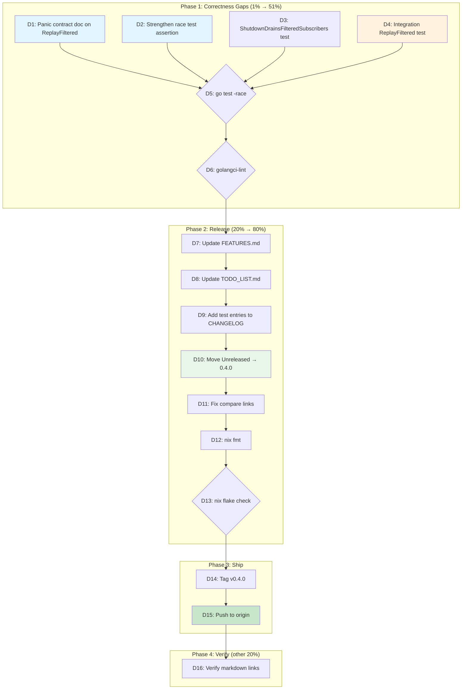

# v0.4.0 Release — Close Correctness Gaps, Cut Release, Push

> Created: 2026-08-03 09:36
> Status: EXECUTED — all 16 tasks shipped (commits `b666ed5`, `649cafe`, `1c05faf`, `1b6028f`). v0.4.0 tagged and pushed to origin/master.

## Problem

Three major feature sets are shipped but unreleased (10 commits ahead of origin):

1. **Predicate-based filtering** — `SubscribeFilter`, `FilteredEventStore`, `ReplayFiltered`
2. **DataStar integration** — `KeyedLines`, `SendLines`, `WriteKeyedLines`, `SendKeyed`, fuzz/benchmark/integration tests, example server, migration guide
3. **Lifecycle management** — `Shutdown(ctx)`, `Health()`, `WithBufferSize`, `BroadcasterHealth`

The predicate-filtering headline feature has **4 known correctness gaps** — all
small (S effort), all identified and documented across two prior self-review
sessions. These are the only things standing between the current state and a
clean v0.4.0 release.

v0.3.0 was tagged empty (no code changes, misleading message). v0.4.0 will be
the first release carrying real feature work since v0.2.1.

## Solution

Close the 4 correctness gaps, cut v0.4.0, push. The gaps are:

1. **No `TestIntegration_ReplayFiltered`** — every other public API has an HTTP round-trip integration test. ReplayFiltered is the asymmetry.
2. **No `TestSubscribeFilter_ShutdownDrainsFilteredSubscribers`** — Shutdown drain logic checks `len(sub.ch)` which should be unaffected by predicates, but it's untested.
3. **Weak race test assertion** — checks `received.Load() > 0` instead of a meaningful threshold like `>= 500`.
4. **Panic contract undocumented on `ReplayFiltered`** — `broadcaster.go` documents "panics crash by design" for SubscribeFilter. `ReplayFiltered` in `replay.go` has the same risk (fallback path calls `pred(evt)` in a loop) but the contract is silent.

## Pareto Breakdown

### The 1% that delivers 51%

Two trivial fixes that close the most embarrassing gaps:

| Item                                        | Impact                            | Why                                                                                                                                                                                                                              |
| ------------------------------------------- | --------------------------------- | -------------------------------------------------------------------------------------------------------------------------------------------------------------------------------------------------------------------------------- |
| Document panic contract on `ReplayFiltered` | Correctness contract completeness | The fallback path calls `pred(evt)` in a loop — same crash risk as SubscribeFilter, but undocumented. One doc comment edit.                                                                                                      |
| Strengthen race test assertion              | Test quality                      | `received.Load() > 0` is barely better than `== 0`. With 4×2000 broadcasts (4000 matching), `>= 500` is a meaningful threshold accounting for non-blocking drops during 500 subscribe/unsubscribe churn cycles. One line change. |

### The 4% that delivers 64%

The above + two tests that close every known correctness hole:

| Item                                                    | Impact                            | Why                                                                                                                                                                                                                                 |
| ------------------------------------------------------- | --------------------------------- | ----------------------------------------------------------------------------------------------------------------------------------------------------------------------------------------------------------------------------------- |
| `TestSubscribeFilter_ShutdownDrainsFilteredSubscribers` | Lifecycle + filtering interaction | Verifies that `Shutdown(ctx)` drain works when subscribers have predicates. The drain checks `len(sub.ch)` — predicates filter before the buffer, so this should work, but it's untested.                                           |
| `TestIntegration_ReplayFiltered`                        | HTTP round-trip completeness      | Every other public API (`Send`, `Broadcast`, `Replay`, `SubscribeFilter`, DataStar wire format) has an HTTP integration test. ReplayFiltered is the only one without. Tests both the FilteredEventStore path and the fallback path. |

### The 20% that delivers 80%

The above + release + push:

| Item                                         | Impact  | Why                                                                                            |
| -------------------------------------------- | ------- | ---------------------------------------------------------------------------------------------- |
| Move `[Unreleased]` → `[0.4.0]` in CHANGELOG | Release | Three feature sets become a versioned release consumers can pin to.                            |
| Tag `v0.4.0`                                 | Release | Git tag for `go get` version resolution.                                                       |
| Push to origin                               | Release | 10+ commits sitting locally. Consumer repos (DiscordSync, cqrs-htmx) can't adopt until pushed. |

### The other 20% (to reach 100%)

Post-release verification and polish:

| Item                                           | Impact          | Why                                                                   |
| ---------------------------------------------- | --------------- | --------------------------------------------------------------------- |
| Verify markdown links after archiving          | Doc correctness | Two planning docs moved to `archived/` — inbound links may be broken. |
| Update TODO_LIST (remove shipped items)        | Doc hygiene     | The 4 correctness gaps will be DONE after this plan executes.         |
| Update FEATURES.md (add new tests to evidence) | Doc accuracy    | New tests need FEATURES.md evidence rows.                             |

## Comprehensive Task Plan (30-100 min tasks)

| #  | Task                                                             | Phase   | Impact   | Effort | Customer Value               |
| -- | ---------------------------------------------------------------- | ------- | -------- | ------ | ---------------------------- |
| T1 | Close all 4 predicate-filtering correctness gaps (doc + 3 tests) | Core    | CRITICAL | M      | Feature is production-ready  |
| T2 | Cut v0.4.0 release (CHANGELOG, tag, TODO_LIST/FEATURES update)   | Release | HIGH     | S      | Consumers can pin to version |
| T3 | Push to origin                                                   | Release | HIGH     | S      | Consumers can adopt          |
| T4 | Post-release verification (links, docs)                          | Verify  | MEDIUM   | S      | Docs are honest              |

## Detailed Breakdown (max 12 min tasks)

| #   | Task                                                                                                                                                                                                            | Parent | Est   |
| --- | --------------------------------------------------------------------------------------------------------------------------------------------------------------------------------------------------------------- | ------ | ----- |
| D1  | Document panic contract on `ReplayFiltered` in `replay.go` — add doc comment matching `broadcaster.go`'s "panics crash by design" language                                                                      | T1     | 5min  |
| D2  | Strengthen race test: change `received.Load() == 0` to `received.Load() < 500` in `filter_test.go:254`                                                                                                          | T1     | 3min  |
| D3  | Write `TestSubscribeFilter_ShutdownDrainsFilteredSubscribers` in `filter_test.go` — subscribe with predicate, broadcast matching + non-matching, call `Shutdown(ctx)`, verify only matching events were drained | T1     | 10min |
| D4  | Write `TestIntegration_ReplayFiltered` in `integration_test.go` — HTTP round-trip with `filteredMemoryStore` (efficient path) and plain store (fallback path), verify only matching events appear in SSE body   | T1     | 12min |
| D5  | Run `go test ./... -race -count=1` — verify all tests pass                                                                                                                                                      | T1     | 2min  |
| D6  | Run `golangci-lint run ./...` — verify 0 issues                                                                                                                                                                 | T1     | 2min  |
| D7  | Update FEATURES.md — add `TestSubscribeFilter_ShutdownDrainsFilteredSubscribers` and `TestIntegration_ReplayFiltered` to evidence columns                                                                       | T2     | 5min  |
| D8  | Update TODO_LIST.md — remove the 4 correctness gap items (now DONE)                                                                                                                                             | T2     | 3min  |
| D9  | Update CHANGELOG.md — add entries for new tests under `[Unreleased] > Added`                                                                                                                                    | T2     | 5min  |
| D10 | Move CHANGELOG `[Unreleased]` → `[0.4.0]` with date, add `[Unreleased]` empty section                                                                                                                           | T2     | 5min  |
| D11 | Update CHANGELOG compare links — add `[0.4.0]` link                                                                                                                                                             | T2     | 2min  |
| D12 | Run `nix fmt` — format all files                                                                                                                                                                                | T2     | 2min  |
| D13 | Run `nix flake check` — hermetic gate                                                                                                                                                                           | T2     | 5min  |
| D14 | Tag `v0.4.0`                                                                                                                                                                                                    | T3     | 2min  |
| D15 | Push commits + tag to origin/master                                                                                                                                                                             | T3     | 2min  |
| D16 | Verify markdown links resolve after archiving (grep + check)                                                                                                                                                    | T4     | 5min  |

## Mermaid Execution Graph

## Risk Assessment

| Risk                                                   | Likelihood | Mitigation                                                                                                                     |
| ------------------------------------------------------ | ---------- | ------------------------------------------------------------------------------------------------------------------------------ |
| New tests flaky under race detector                    | LOW        | Use deterministic channel synchronization, not `time.Sleep`                                                                    |
| `Shutdown` + filtered subscriber interaction has a bug | LOW        | The drain path checks `len(sub.ch)`, predicates filter before the buffer. But if a bug IS found, that's the point of the test. |
| v0.4.0 CHANGELOG section misses an entry               | LOW        | The `[Unreleased]` section is already comprehensive — just needs the version header + date.                                    |
| Push rejected (force-push needed)                      | NEGLIGIBLE | Working tree is clean, fast-forward push.                                                                                      |
